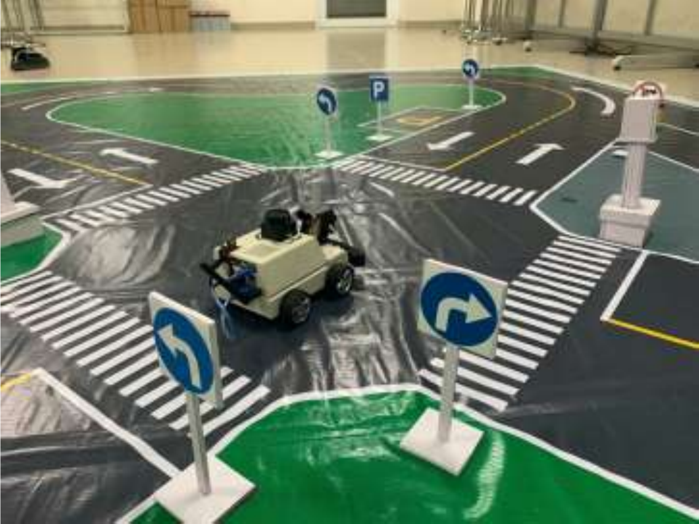
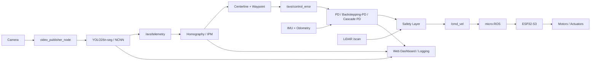
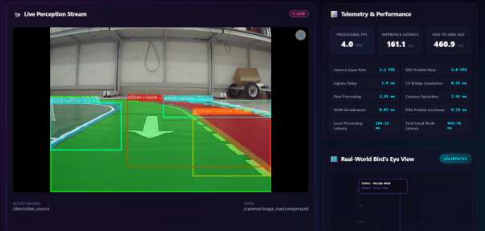
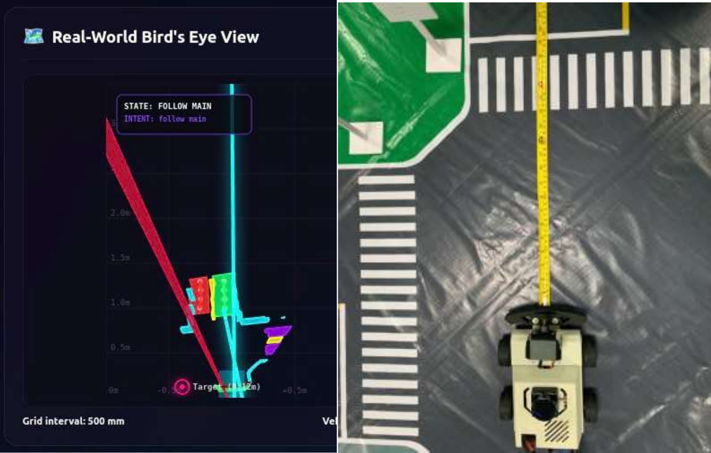
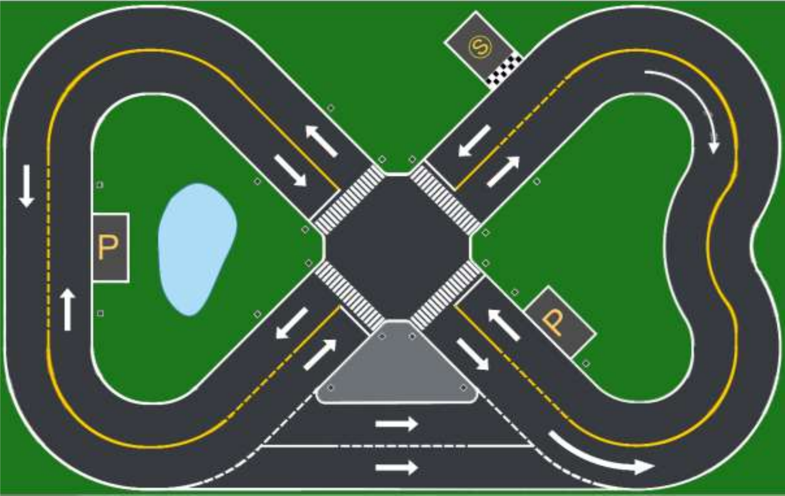
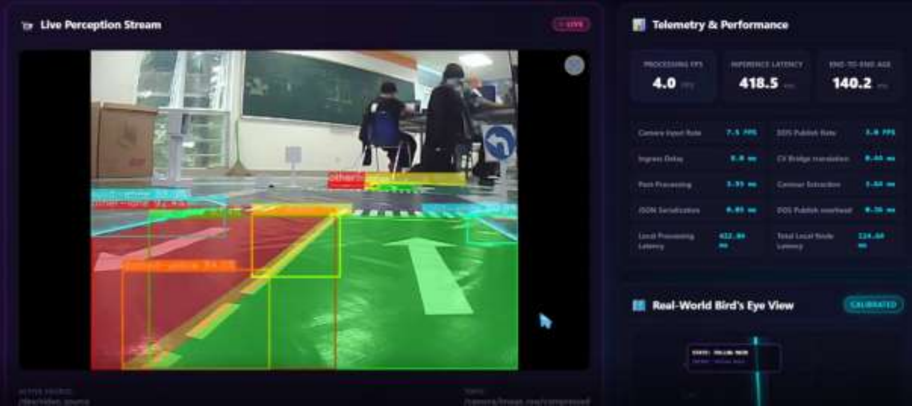

<div align="center">

# ROS 2 Autonomous Vision Robot

### ROS 2 / micro-ROS autonomous robot with real-time vision, lane geometry and closed-loop control

[](https://docs.ros.org/en/humble/)
[](https://isocpp.org/)
[](https://opencv.org/)
[](https://github.com/Tencent/ncnn)
[](https://www.raspberrypi.com/)
[](https://www.docker.com/)

**Graduation project:** *Development of a ROS 2/micro-ROS Autonomous Robot Car Platform Integrated with Computer Vision for a Miniature Urban Model.*



</div>

---

## Overview

This project develops a **model-scale autonomous robot car** on the **MicroROS-Car-Pi5** platform. A **Raspberry Pi 5** runs the high-level ROS 2 perception, geometry, control, dashboard and logging stack, while an **ESP32-S3** provides low-level hardware integration through **micro-ROS**.

The perception pipeline converts camera images into control-ready geometric information using **YOLO26n-seg + NCNN**, **Homography/IPM**, centerline extraction and waypoint generation. The robot is evaluated with **PD**, **Backstepping-PD** and **Cascade PD** lane-following controllers, with **LiDAR-based slowdown and emergency stopping**.

> **Scope:** designed and validated on an indoor miniature urban testbed for robotics research and education - not for real-road autonomous driving.

## System Architecture



### Core data flow

`Camera -> Segmentation -> Polygon -> IPM -> Centerline/Waypoint -> Geometric Error -> Controller -> /cmd_vel -> micro-ROS -> Robot`

## Computer Vision Pipeline

The **AVS (Autonomous Vision System)** is organized as independent ROS 2 nodes so that each stage can be tested and debugged separately:

- `video_publisher_node` - camera/video acquisition.
- `ncnn_inference_node` - YOLO segmentation and pixel-space telemetry.
- `ipm_transform_node` - pixel-to-world transformation using Homography/IPM.
- `control_node` - vision geometry post-processing and `/avs/control_error` generation.
- `video_test_node` - offline testing, FPS and latency evaluation.

The segmentation dataset contains **19 classes**, including lane surfaces, road markings, stop lines, parking regions, vehicles and traffic-related objects.

<table>
<tr>
<td width="50%" align="center">
<br/>
<b>YOLO segmentation + live telemetry</b>
</td>
<td width="50%" align="center">
<br/>
<b>Real-world Bird's Eye View after IPM</b>
</td>
</tr>
</table>

## Model Results

The reported YOLO26n-seg model was trained on a **Kaggle T4 GPU** with 320x320 input images. Training stopped at epoch 260 through early stopping; the best model is approximately **6.6 MB**, with **2.69M parameters** and about **9.0 GFLOPs**.

| Validation metric | Bounding box | Segmentation mask |
|---|---:|---:|
| Precision | 0.850 | **0.831** |
| Recall | 0.794 | **0.783** |
| mAP@0.5 | 0.850 | **0.823** |
| mAP@0.5:0.95 | 0.681 | **0.548** |

Additional reported results:

- Validation set: **993 images / 7,500 instances / 19 classes**.
- `main-lane` mask mAP@0.5: approximately **0.991**.
- `other-lane` mask mAP@0.5: approximately **0.976**.
- In a ~0.5 m IPM test, transformed distance differed from physical measurement by approximately **2-3 cm**.

## Control & Safety

The control layer publishes standard `geometry_msgs/Twist` commands:

- `linear.x` - commanded linear velocity.
- `angular.z` - commanded angular velocity.

Three control approaches are investigated:

| Controller | Purpose |
|---|---|
| **PD** | Lane-centering from lateral and heading errors |
| **Backstepping-PD** | Model-based trajectory/error stabilization |
| **Cascade PD** | Outer lane-following loop + inner velocity feedback loop |

Safety logic applies velocity/angular-rate limits, command smoothing and LiDAR-based slowdown/stop before publishing `/cmd_vel`. Experiments cover straight roads, curves, intersections and stop-line scenarios.

## Hardware & Software

| Layer | Components |
|---|---|
| High-level compute | Raspberry Pi 5 |
| Low-level controller | ESP32-S3 + micro-ROS |
| Vision | PTZ camera, OpenCV, YOLO26n-seg, NCNN |
| Range sensing | TOF/MS200 LiDAR |
| Motion feedback | IMU, encoders, odometry |
| Robot drive | 4-wheel skid-steer platform |
| Middleware | ROS 2 Humble, DDS, micro-ROS |
| Deployment | Docker / Docker Compose |
| Simulation | MATLAB / Simulink |
| Monitoring | Web dashboard + ROS 2 logging |

### Main ROS 2 topics

```text
/camera/image_raw
/camera/image_raw/compressed
/avs/telemetry
/avs/telemetry_realworld
/avs/control_error
/avs/lane_target
/scan
/odom_raw
/imu
/cmd_vel
/avs/control_state
/avs/control_log
```

## Test Environment

The robot is evaluated on a repeatable miniature urban environment containing straights, curves, intersections, lane markings, stop lines and parking areas.

<p align="center">

</p>

Intersection perception was also verified through the live dashboard:

<p align="center">

</p>

## Repository Structure

```text
ros2_ws/src/
├── avs_perception/
├── avs_controlsystem/
├── avs_cascadecontrol/
├── avs_hybridcontrol/
├── avs_pdbackstepingcontrol/
└── yahboomcar_description/

docker/
web_dashboard/
config/
models/
docker-compose.yml
```

## Quick Start

### Docker

```bash
git clone https://github.com/chanhuynguyen-ai/ROS-2-Micro-ROS-autonomous-robot-with-integrated-computer-vision.git
cd ROS-2-Micro-ROS-autonomous-robot-with-integrated-computer-vision

docker compose build
docker compose up
```

### Native ROS 2 build

Ubuntu 22.04 + ROS 2 Humble, OpenCV and NCNN are required.

```bash
source /opt/ros/humble/setup.bash
cd ros2_ws

rosdep install --from-paths src --ignore-src -r -y --rosdistro humble
colcon build --symlink-install --cmake-args -DCMAKE_BUILD_TYPE=Release
source install/setup.bash
```

Inspect the perception executables:

```bash
ros2 pkg executables avs_perception
```

