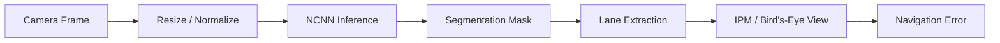
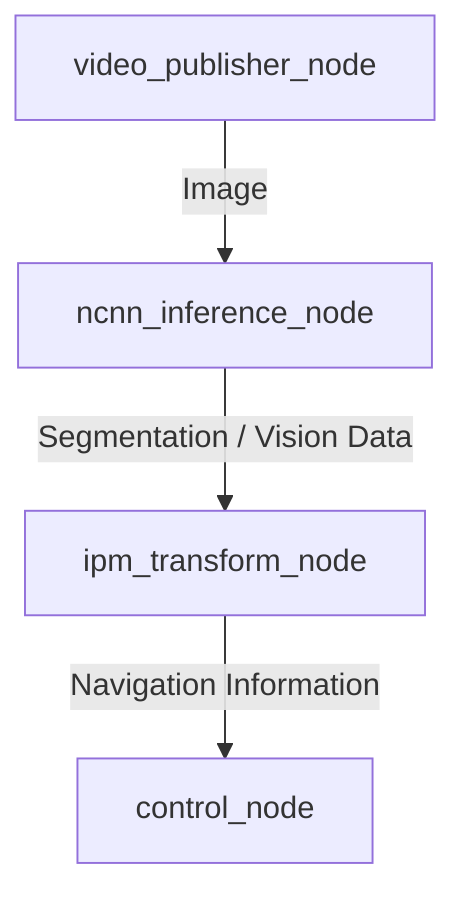
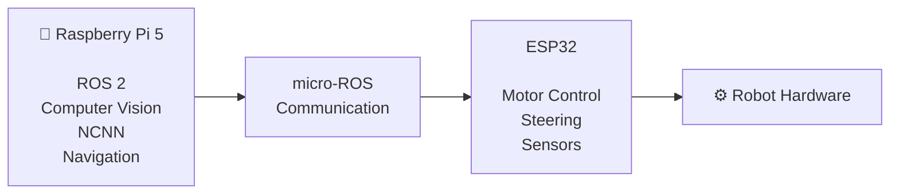

<div align="center">

# 🤖 ROS 2 Autonomous Vision Robot

### Real-Time Computer Vision & Autonomous Control Platform for Edge Robotics

<p>
  <strong>ROS 2 Humble · Computer Vision · NCNN · OpenCV · Raspberry Pi 5 · ESP32 · micro-ROS</strong>
</p>

<p>
  
  
  
  
</p>

<p>
  
  
  
</p>

**A modular autonomous mobile robot platform combining real-time vision, lane understanding, ROS 2 control, edge AI inference, and embedded robotics.**

</div>

---

## 📌 Overview

**ROS 2 Autonomous Vision Robot** is an autonomous robotics project built around **ROS 2 Humble** and designed to explore the complete pipeline from visual perception to robot control.

Instead of treating computer vision as an isolated AI demo, this project integrates:

* camera acquisition,
* neural-network inference,
* lane and road understanding,
* inverse perspective mapping,
* trajectory / lateral error estimation,
* autonomous control algorithms,
* ROS 2 communication,
* and embedded robot actuation.

The target architecture uses a **Raspberry Pi 5** as the high-level computing platform and an **ESP32** as the low-level embedded controller.

A major focus of the project is achieving practical **CPU-based edge inference** using **NCNN**, allowing the perception stack to run without requiring a dedicated GPU.

---

## ✨ Highlights

<table>
<tr>
<td width="50%">

### 👁️ Computer Vision

* Real-time camera processing
* Road and lane segmentation
* Vehicle detection / segmentation
* OpenCV preprocessing
* Inverse Perspective Mapping
* Navigation-oriented perception

</td>

<td width="50%">

### 🧠 Edge AI

* NCNN inference backend
* CPU-oriented deployment
* Raspberry Pi 5 target
* ARM optimization
* FP16 / INT8 optimization path
* Low-resource inference architecture

</td>
</tr>

<tr>
<td width="50%">

### 🤖 Robotics

* ROS 2 Humble
* Modular ROS 2 nodes
* Robot description package
* Distributed perception pipeline
* Multiple control strategies
* Autonomous navigation research

</td>

<td width="50%">

### ⚙️ Embedded Systems

* ESP32 target controller
* micro-ROS architecture
* Motor / steering control
* Raspberry Pi ↔ MCU separation
* Real-world robot deployment

</td>
</tr>
</table>

---

# 🏗️ System Architecture

```mermaid
flowchart LR

    CAM["📷 USB Camera / Video"]
    PUB["ROS 2<br/>Video Publisher"]
    AI["🧠 NCNN<br/>Segmentation"]
    IPM["🗺️ IPM<br/>Transform"]
    NAV["📐 Lane / Trajectory<br/>Estimation"]
    CTRL["🎛️ Autonomous<br/>Controller"]
    CMD["ROS 2<br/>Motion Command"]
    UROS["micro-ROS"]
    ESP["ESP32"]
    MOTOR["⚙️ Motor / Steering"]

    CAM --> PUB
    PUB --> AI
    AI --> IPM
    IPM --> NAV
    NAV --> CTRL
    CTRL --> CMD
    CMD --> UROS
    UROS --> ESP
    ESP --> MOTOR
```



### Data Flow

```text
Camera / Video
      │
      ▼
ROS 2 Image Publisher
      │
      ▼
NCNN Segmentation Inference
      │
      ▼
Lane / Road Perception
      │
      ▼
Inverse Perspective Mapping
      │
      ▼
Trajectory / Lateral Error
      │
      ▼
Autonomous Controller
      │
      ▼
ROS 2 Motion Command
      │
      ▼
micro-ROS
      │
      ▼
ESP32
      │
      ▼
Motor + Steering
```

---

# 👁️ Computer Vision Pipeline

The perception layer is designed to transform raw camera frames into navigation information usable by the robot controller.

## Supported perception concepts

The project architecture includes road-scene classes such as:

```text
main-lane
other-lane
turn-lane

solid-white
solid-yellow

dashed-white
dashed-yellow

stop-line
parking-slot
vehicle
```

### Perception workflow



---

# ⚡ Edge AI Optimization

The project is designed with **Raspberry Pi-class hardware** in mind.

Key optimization strategies include:

* NCNN inference instead of heavyweight desktop inference runtimes
* CPU-oriented neural-network execution
* ARM NEON-compatible processing
* optimized OpenCV operations
* Release-mode C++ compilation
* reduced memory-copy overhead
* FP16 / INT8 inference optimization path
* MJPEG camera input support
* modular ROS 2 processing nodes

The objective is to maintain a practical balance between:

> **Inference accuracy × latency × CPU usage × deployability**

---

# 🧩 ROS 2 Architecture

The primary ROS 2 workspace is:

```text
ros2_ws/
└── src/
```

Current packages include:

| Package                    | Role                                                    |
| -------------------------- | ------------------------------------------------------- |
| `avs_perception`           | Computer vision, inference, IPM and perception pipeline |
| `avs_controlsystem`        | Autonomous control experiments                          |
| `avs_cascadecontrol`       | Cascade controller implementation                       |
| `avs_hybridcontrol`        | Hybrid control strategy                                 |
| `avs_pdbackstepingcontrol` | PD / Backstepping control experiments                   |
| `yahboomcar_description`   | Robot model and description resources                   |

---

## 🔍 Perception Nodes

The `avs_perception` package includes several core executables:

```text
ncnn_inference_node
video_test_node
video_publisher_node
ipm_transform_node
control_node
```

### Example ROS graph



---

# 🎛️ Control Systems

One objective of this project is to compare different autonomous-control strategies under the same perception pipeline.

Implemented / experimental controllers include:

### Cascade Control

```text
Perception
    ↓
Outer Control Loop
    ↓
Inner Control Loop
    ↓
Robot Command
```

### PD / Backstepping Control

Used to investigate nonlinear and error-driven motion-control strategies.

### Hybrid Control

Combines multiple control concepts for more flexible autonomous behavior.

### Control System Module

Provides an additional architecture for evaluating navigation and motion-control logic.

---

# 🔌 Embedded Architecture

The intended hardware separation is:



### Raspberry Pi 5

Responsible for:

* camera acquisition
* computer vision
* neural-network inference
* navigation logic
* ROS 2 communication
* high-level control

### ESP32

Designed for:

* low-level motor control
* steering commands
* hardware interfaces
* real-time embedded tasks

---

# 🛠️ Technology Stack

| Category            | Technologies           |
| ------------------- | ---------------------- |
| Robotics            | ROS 2 Humble           |
| Vision              | OpenCV                 |
| AI Inference        | NCNN                   |
| Languages           | C++17, Python 3.10     |
| Embedded            | ESP32                  |
| Embedded Middleware | micro-ROS              |
| Edge Platform       | Raspberry Pi 5         |
| Containers          | Docker, Docker Compose |
| Build System        | CMake, Colcon          |
| Robot Description   | URDF / ROS ecosystem   |
| Web Components      | FastAPI, WebSocket     |

---

# 📂 Repository Structure

```text
.
├── config/
│   └── Runtime and perception configuration
│
├── docker/
│   ├── Dockerfile
│   └── Container entrypoint
│
├── models/
│   └── AI model assets
│
├── ros2_ws/
│   └── src/
│       ├── avs_perception/
│       ├── avs_controlsystem/
│       ├── avs_cascadecontrol/
│       ├── avs_hybridcontrol/
│       ├── avs_pdbackstepingcontrol/
│       └── yahboomcar_description/
│
├── test/
│   └── Test media and development resources
│
├── web_dashboard/
│   └── Monitoring / visualization components
│
├── docker-compose.yml
│
└── README.md
```

---

# 🚀 Getting Started

## Requirements

Recommended environment:

```text
Ubuntu 22.04
ROS 2 Humble
CMake
Colcon
OpenCV
NCNN
Docker (optional)
```

---

## 1️⃣ Clone Repository

```bash
git clone https://github.com/chanhuynguyen-ai/ROS-2-Micro-ROS-autonomous-robot-with-integrated-computer-vision.git

cd ROS-2-Micro-ROS-autonomous-robot-with-integrated-computer-vision
```

---

# 🐳 Docker

Build the environment:

```bash
docker compose build
```

Start the services:

```bash
docker compose up
```

The Docker environment provides the ROS 2 and computer-vision dependencies used by the project.

---

# 🧱 Native ROS 2 Build

Source ROS 2:

```bash
source /opt/ros/humble/setup.bash
```

Enter the workspace:

```bash
cd ros2_ws
```

Build:

```bash
colcon build \
    --symlink-install \
    --cmake-args \
    -DCMAKE_BUILD_TYPE=Release
```

Source the workspace:

```bash
source install/setup.bash
```

---

# ▶️ Running the Vision Pipeline

## Video Publisher

```bash
ros2 run avs_perception video_publisher_node
```

## NCNN Inference

```bash
ros2 run avs_perception ncnn_inference_node
```

## IPM Transform

```bash
ros2 run avs_perception ipm_transform_node
```

## Control Node

```bash
ros2 run avs_perception control_node
```

---

# 🔎 Debugging ROS 2

List active nodes:

```bash
ros2 node list
```

List topics:

```bash
ros2 topic list
```

Inspect a node:

```bash
ros2 node info <node_name>
```

Measure topic frequency:

```bash
ros2 topic hz <topic_name>
```

---

# 🧪 Engineering Objectives

This repository explores several engineering problems simultaneously.

## Computer Vision

```text
Camera
→ Image Processing
→ Segmentation
→ Lane Understanding
→ Navigation Information
```

## Edge AI

```text
Neural Network
→ NCNN
→ CPU Optimization
→ Raspberry Pi Deployment
```

## Robotics

```text
Perception
→ Decision
→ Control
→ Motion
```

## Embedded Systems

```text
Raspberry Pi
→ micro-ROS
→ ESP32
→ Actuator
```

---

# 📈 Development Status

| Module                        | Status                                     |
| ----------------------------- | ------------------------------------------ |
| ROS 2 workspace               | ✅ Implemented                              |
| Camera / video pipeline       | ✅ Implemented                              |
| NCNN inference integration    | ✅ Implemented                              |
| IPM module                    | ✅ Implemented                              |
| Multiple controllers          | ✅ Implemented / Experimental               |
| Docker environment            | ✅ Available                                |
| Raspberry Pi optimization     | ✅ In progress / implemented at build level |
| Unified production controller | 🚧 In progress                             |
| Complete Twist pipeline       | 🚧 In progress                             |
| ESP32 production integration  | 🚧 In progress                             |
| Full autonomous hardware demo | 📌 Planned                                 |
| Automated benchmarks          | 📌 Planned                                 |
| ROS 2 CI pipeline             | 📌 Planned                                 |

> The repository is under active development. Experimental modules are intentionally preserved to evaluate different perception and control approaches.

---

# 🗺️ Roadmap

### Phase 1 — Perception

* [x] ROS 2 camera pipeline
* [x] Neural-network inference
* [x] Lane / road segmentation
* [x] NCNN integration
* [x] IPM transformation

### Phase 2 — Control

* [x] Cascade controller
* [x] Hybrid controller
* [x] PD / Backstepping experiments
* [ ] Select production controller
* [ ] Standardize motion command interface

### Phase 3 — Embedded Robot

* [ ] Complete micro-ROS communication
* [ ] ESP32 actuator interface
* [ ] Motor / steering integration
* [ ] Hardware safety layer

### Phase 4 — Edge Deployment

* [x] Raspberry Pi-oriented optimization
* [x] Docker environment
* [ ] Raspberry Pi 5 benchmark suite
* [ ] CPU / memory profiling
* [ ] End-to-end latency benchmark

### Phase 5 — Production Quality

* [ ] ROS 2 integration tests
* [ ] GitHub Actions CI
* [ ] Full robot demonstration
* [ ] Performance report
* [ ] Production launch configuration

---

# 🎯 Project Goals

The long-term objective is to build a practical platform for researching and demonstrating:

* autonomous lane following
* visual navigation
* computer vision for robotics
* edge AI deployment
* control-system comparison
* ROS 2 distributed architecture
* embedded robot communication
* real-time perception
* Raspberry Pi AI optimization

Unlike a standalone AI model, this project focuses on **system-level robotics engineering**.

```text
AI
+
Computer Vision
+
ROS 2
+
Control Systems
+
Embedded Hardware
=
Autonomous Robot
```

---

# 💡 Why This Project Matters

Building an autonomous robot requires more than training an AI model.

A real robot must connect:

```text
Perception
      ↓
Understanding
      ↓
Decision
      ↓
Control
      ↓
Embedded Hardware
      ↓
Physical Motion
```

This repository is an attempt to integrate those layers into a single practical engineering platform.

---

# 🔮 Future Improvements

Potential future development includes:

* ONNX → NCNN automated conversion pipeline
* INT8 quantization benchmarking
* camera calibration tools
* improved lane center estimation
* obstacle avoidance
* multi-sensor fusion
* IMU integration
* odometry integration
* autonomous parking
* RViz visualization improvements
* real-time web dashboard telemetry
* ROS 2 launch orchestration
* automated deployment scripts
* hardware-in-the-loop testing

---

# 🤝 Contributions

Technical discussions, bug reports and improvements related to the following areas are welcome:

* ROS 2
* Computer Vision
* Edge AI
* Autonomous Robotics
* Embedded Systems
* Control Engineering

---

# 👨‍💻 Author

**Nguyen Chan Huy**

Robotics & Artificial Intelligence Engineering

Focus areas:

```text
Computer Vision
Artificial Intelligence
Autonomous Robotics
ROS 2
Edge AI
```

GitHub:

**[@chanhuynguyen-ai](https://github.com/chanhuynguyen-ai)**

---

<div align="center">

## ⭐ If you find this project interesting, consider giving it a star.

### ROS 2 · Computer Vision · Edge AI · Autonomous Robotics

</div>
