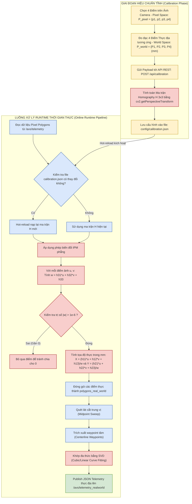

# PHẦN II.3. Biến đổi phối cảnh ngược bằng homography

## 1. Mở đầu

Trong hệ thống Computer Vision của AVS, đầu ra từ mô hình phân đoạn ban đầu chỉ tồn tại trong **hệ tọa độ ảnh**. Mỗi điểm trên contour hoặc polygon của làn đường được biểu diễn bởi cặp pixel `(u, v)`. Tuy nhiên, bài toán điều hướng và bám làn không thể làm việc trực tiếp với pixel, vì pixel chỉ là đại lượng phụ thuộc vào góc nhìn camera, vị trí lắp camera và phối cảnh ảnh.

Mục tiêu thực sự của hệ thống là suy ra các đại lượng hình học có ý nghĩa vật lý như:

- độ lệch ngang của xe so với lane
- khoảng cách dọc phía trước
- góc hướng của lane
- độ cong của quỹ đạo

Các đại lượng này phải được biểu diễn trong một hệ tọa độ thực gắn với xe, với đơn vị milimet. Vì vậy, cần một bước biến đổi từ không gian ảnh sang không gian mặt đường. Trong hệ thống hiện tại, bước này được thực hiện bằng **homography phẳng**, còn được gọi là **Inverse Perspective Mapping (IPM)**.

## 2. Vì sao phải chuyển từ pixel sang tọa độ thực

### 2.1. Hạn chế của sai số pixel

Sai số đo bằng pixel không phản ánh trực tiếp khoảng cách vật lý trên mặt đường. Cùng một độ lệch `20` pixel nhưng ý nghĩa thực tế của nó thay đổi tùy theo vị trí trong ảnh:

- ở gần mép dưới ảnh, `20` pixel có thể tương ứng với vài chục milimet
- ở gần phía trên ảnh, `20` pixel có thể tương ứng với vài trăm milimet

Nguyên nhân là ảnh camera chịu ảnh hưởng của phối cảnh:

- vật ở xa trông nhỏ hơn vật ở gần
- các đường song song ngoài thực tế hội tụ trong ảnh
- cùng một chiều rộng thực của lane nhưng số pixel thay đổi theo vị trí dọc ảnh

Do đó, nếu điều hướng trực tiếp dựa trên pixel thì:

- sai số không đồng nhất theo khoảng cách
- các frame khó so sánh ổn định với nhau
- rất khó đặt ngưỡng điều khiển theo ý nghĩa vật lý

### 2.2. Lợi ích của hệ tọa độ thực

Sau khi đổi sang mặt phẳng thực, mọi điểm được biểu diễn bằng milimet trong hệ quy chiếu gắn với xe. Điều này mang lại các lợi ích sau:

- dữ liệu có ý nghĩa vật lý trực tiếp
- dễ so sánh giữa các frame
- dễ suy ra các đại lượng `e_x`, `e_y`, `theta`
- dễ fit đa thức cho lane theo biến hình học thật
- dễ tích hợp với các khối điều khiển, lập quỹ đạo và dashboard

Ví dụ, thay vì nói "xe lệch `35` pixel", hệ thống có thể nói "xe lệch `120 mm` sang phải". Đây là thông tin có thể dùng trực tiếp trong các luật điều khiển.

## 3. Bản chất của biến đổi phối cảnh ngược

Camera nhìn mặt đường dưới góc xiên nên ảnh thu được không phải là hình chiếu vuông góc từ trên xuống. Biến đổi phối cảnh ngược có nhiệm vụ ánh xạ các điểm trên ảnh camera về một mặt phẳng đích xấp xỉ **bird's-eye view** hoặc ít nhất là hệ tọa độ thực trên mặt đường.

Điều kiện cốt lõi để dùng homography là:

- các điểm cần biến đổi cùng nằm trên một mặt phẳng

Trong bài toán này, mặt phẳng đó là **mặt đường**. Đây là giả định hợp lý vì hệ thống đang hoạt động trên sàn hoặc đường phẳng trong môi trường thử nghiệm.

Khi giả định này đúng, tồn tại một ma trận `H` kích thước `3 x 3` sao cho mỗi điểm ảnh trên mặt đường có thể được ánh xạ sang điểm thực tương ứng trên mặt đất.

## 4. Mô hình toán học của homography phẳng

### 4.1. Biểu diễn điểm trong tọa độ đồng nhất

Một điểm ảnh được viết ở dạng tọa độ đồng nhất:

$$
p=\begin{bmatrix}u\\v\\1\end{bmatrix}
$$

trong đó:

- `u`: tọa độ ngang trên ảnh
- `v`: tọa độ dọc trên ảnh

Một điểm trên mặt phẳng thực được viết:

$$
P=\begin{bmatrix}X\\Y\\1\end{bmatrix}
$$

trong đó:

- `X`: tọa độ ngang thực, đơn vị mm
- `Y`: tọa độ dọc thực, đơn vị mm

### 4.2. Phương trình homography

Quan hệ giữa hai điểm được mô tả bởi:

$$
\lambda P = H p
$$

với:

$$
H=
\begin{bmatrix}
h_{11} & h_{12} & h_{13}\\
h_{21} & h_{22} & h_{23}\\
h_{31} & h_{32} & h_{33}
\end{bmatrix}
$$

và `\lambda` là hệ số tỉ lệ đồng nhất.

Sau khi khai triển và chuẩn hóa, ta thu được công thức biến đổi trực tiếp:

$$
X=\frac{h_{11}u+h_{12}v+h_{13}}{h_{31}u+h_{32}v+h_{33}}
$$

$$
Y=\frac{h_{21}u+h_{22}v+h_{23}}{h_{31}u+h_{32}v+h_{33}}
$$

Trong mã nguồn hiện tại tại `ipm_transform_node.cpp`, biến trung gian:

$$
w = h_{31}u + h_{32}v + h_{33}
$$

được tính trước. Nếu `|w|` quá nhỏ, điểm đó bị bỏ qua để tránh mất ổn định số.

### 4.3. Ý nghĩa của mẫu số

Mẫu số:

$$
h_{31}u+h_{32}v+h_{33}
$$

là phần tạo nên tính chất phối cảnh của phép biến đổi. Nếu chỉ có biến đổi affine, mẫu số này là hằng. Khi có phối cảnh, mẫu số thay đổi theo vị trí điểm, cho phép mô hình hóa hiện tượng:

- vật ở xa bị co lại
- đường song song hội tụ

Đây là lý do homography mạnh hơn các phép biến đổi tuyến tính thuần túy như tịnh tiến, quay hoặc scale trong không gian Euclid.

## 5. Giả định phẳng và tính phù hợp với hệ thống AVS

Homography chỉ đúng chính xác cho các điểm cùng thuộc một mặt phẳng. Trong hệ thống AVS, giả định này phù hợp với các đối tượng sau:

- vùng `main-lane`
- vùng `other-lane`
- vùng `turn-lane`
- `stop-line`
- các vạch kẻ đường

Các điểm contour của những đối tượng này nằm trên mặt đường hoặc rất gần mặt đường, nên có thể ánh xạ hợp lý bằng cùng một ma trận `H`.

Ngược lại, với các đối tượng nổi khỏi mặt phẳng như:

- xe
- biển báo dựng đứng

homography phẳng không còn phản ánh đúng hoàn toàn hình học 3D. Vì vậy, trong pipeline AVS, homography chủ yếu phục vụ cho lane geometry và các thành phần nằm trên nền đường.

## 6. Hệ tọa độ thực gắn với xe

### 6.1. Định nghĩa hệ trục

Theo dàn ý của `../avs_system_report_outline.md`, hệ tọa độ thực được chọn sao cho:

- gốc tọa độ nằm tại điểm tham chiếu trên mặt đường gắn với xe
- trục `X` hướng ngang, dương sang phải
- trục `Y` hướng dọc, dương về phía trước

Đây là hệ tọa độ phù hợp cho điều khiển bám làn vì:

- `X` phản ánh độ lệch ngang
- `Y` phản ánh khoảng nhìn trước
- mọi đại lượng định hướng có thể định nghĩa theo tiếp tuyến của lane trong hệ này

### 6.2. Ý nghĩa điều khiển của `X` và `Y`

Nếu một điểm centerline của lane có tọa độ:

$$
(X, Y)
$$

thì:

- `X > 0`: điểm nằm bên phải trục xe
- `X < 0`: điểm nằm bên trái trục xe
- `Y > 0`: điểm nằm phía trước xe

Từ đây, các đại lượng như `epsilon_x_mm`, `epsilon_y_mm`, `theta_rad` có thể được suy ra một cách nhất quán.

### 6.3. Mối liên hệ với fit đường cong

Sau khi polygon lane được biến đổi sang world frame, hệ thống có thể:

- quét lát cắt theo `Y` cho lane dọc
- quét lát cắt theo `X` cho lane rẽ
- tạo waypoint trung tâm
- fit đa thức bậc 3

Nhờ vậy, homography là cầu nối bắt buộc giữa phân đoạn ảnh và khối suy ra hình học điều khiển.

### 6.4. Sơ đồ luồng hoạt động của hệ thống IPM (Homography/IPM Pipeline flowchart)

Dưới đây là sơ đồ chi tiết biểu diễn hai luồng xử lý chính: luồng hiệu chuẩn offline (được kích hoạt từ Web Dashboard) và luồng biến đổi trực tiếp ở runtime (được thực thi bởi node `ipm_transform_node`):



## 7. Quy trình áp dụng homography trong hệ thống hiện tại

### 7.1. Dữ liệu đầu vào của `ipm_transform_node`

Node `ipm_transform_node` subscribe topic:

`/avs/telemetry`

Topic này chứa JSON mô tả các object perception, trong đó mỗi object có thể chứa:

- `label`
- `box`
- `polygons`
- `track_id`

Các `polygons` lúc này vẫn đang ở hệ pixel ảnh.

### 7.2. Nạp ma trận `H` từ file calibration

Node khai báo parameter:

`calibration_file_path`

với mặc định:

`/workspace/config/calibration.json`

Khi khởi động, node gọi `load_calibration()` để đọc file JSON và nạp trường:

`homography_matrix`

Nếu file không tồn tại, sai định dạng hoặc không có trường này, cờ `has_calibration_` bị đặt `false` và node sẽ không publish dữ liệu world-space hợp lệ.

### 7.3. Reload calibration khi file thay đổi

Một điểm triển khai quan trọng là node không chỉ đọc calibration một lần. Trong mỗi callback xử lý telemetry, node gọi `check_calibration_update()` để:

- kiểm tra file còn tồn tại hay không
- so sánh `last_write_time`
- tự động reload nếu calibration mới được lưu

Cơ chế này phù hợp với workflow dùng dashboard:

- người dùng mở giao diện calibration
- chọn lại 4 điểm
- lưu ma trận mới
- node IPM tự nhận ma trận mới mà không cần restart toàn hệ thống

### 7.4. Biến đổi từng điểm polygon

Với mỗi object, node tạo trường mới:

`polygons_real_world`

Sau đó, với từng điểm pixel `[u, v]` trong mỗi polygon, node áp dụng trực tiếp công thức:

$$
w = h_{31}u + h_{32}v + h_{33}
$$

$$
X = \frac{h_{11}u+h_{12}v+h_{13}}{w}
$$

$$
Y = \frac{h_{21}u+h_{22}v+h_{23}}{w}
$$

Kết quả được làm tròn đến `0.1 mm` trước khi ghi vào JSON. Mỗi polygon ở pixel space vì thế được biến thành một polygon tương ứng trong world space.

### 7.5. Đầu ra của node

Node publish JSON mới lên topic:

`/avs/telemetry_realworld`

Từ đây, các khối sau có thể dùng:

- `polygons_real_world`
- `waypoints`
- `polynomial`
- `lateral_offset_mm`
- `longitudinal_offset_mm`
- `heading_angle_rad`

Nói cách khác, homography không phải bước hiển thị phụ, mà là một tầng cốt lõi trong pipeline perception-to-control.

## 8. Quy trình hiệu chuẩn homography

### 8.1. Mục tiêu của calibration

Ma trận `H` không thể chọn bằng tay một cách đáng tin cậy. Nó phải được suy ra từ các cặp điểm tương ứng giữa:

- ảnh camera
- mặt phẳng thực

Calibration có nhiệm vụ tạo ra đúng ma trận `H` cho cấu hình camera hiện tại.

### 8.2. Tối thiểu 4 cặp điểm không thẳng hàng

Về mặt hình học xạ ảnh, homography `3 x 3` có 8 bậc tự do độc lập do ma trận chỉ xác định đến một hệ số tỉ lệ. Vì vậy, tối thiểu cần:

- 4 cặp điểm tương ứng
- các điểm không được thẳng hàng

Giả sử có bốn điểm ảnh:

$$
(u_i, v_i), \quad i=1,\dots,4
$$

và bốn điểm thực:

$$
(X_i, Y_i), \quad i=1,\dots,4
$$

thì có thể giải ra ma trận `H` sao cho bốn điểm ảnh ánh xạ đúng sang bốn điểm thực tương ứng.

### 8.3. Triển khai hiệu chuẩn trong dashboard/backend hiện tại

Frontend dashboard cho phép người dùng:

1. lấy một frame tĩnh từ camera
2. click đúng 4 điểm trên ảnh
3. nhập 4 tọa độ thực tương ứng theo đơn vị mm
4. gửi payload tới API `/api/calibration`

Payload hiện tại có dạng:

```json
{
  "pixel_points": [[u1, v1], [u2, v2], [u3, v3], [u4, v4]],
  "world_points": [[X1, Y1], [X2, Y2], [X3, Y3], [X4, Y4]],
  "image_size": [640, 480]
}
```

Ở backend, API dùng:

`cv2.getPerspectiveTransform(src, dst)`

để tính ma trận `H` từ 4 cặp điểm này.

### 8.4. Cấu trúc file `config/calibration.json`

Sau khi hiệu chuẩn, backend ghi file `config/calibration.json`. Theo định dạng hiện tại của repo, file chứa:

- `homography_matrix`
- `pixel_points`
- `world_points`
- `image_size`
- `calibrated_at`

Ví dụ:

```json
{
  "homography_matrix": [
    [-0.696146323238539, -0.04708639180695328, 238.6975847215506],
    [-0.03667146499054984, 0.7466169069491455, -509.15437782954604],
    [0.00008268867302536152, -0.006619077183420509, 1.0]
  ],
  "pixel_points": [[145,250], [511,257], [597,306], [58,294]],
  "world_points": [[-196,510], [196,510], [196,310], [-196,310]],
  "image_size": [640,480],
  "calibrated_at": "2026-06-17T08:28:16.663447"
}
```

Lưu thêm các cặp điểm calibration là cần thiết vì:

- có thể kiểm tra lại tính hợp lệ của `H`
- dễ tái hiện cấu hình đã dùng
- thuận tiện debug nếu world-space bị sai

## 9. Suy luận hình học từ polygon sau homography

Sau khi polygon lane được ánh xạ sang world frame, node IPM tiếp tục thực hiện hậu xử lý hình học.

### 9.1. Lane dọc

Với `main-lane` và `other-lane`, node quét lát cắt theo `Y`, tìm giao điểm trái-phải của polygon, lấy trung điểm rồi tạo centerline rời rạc:

$$
x_{mid}(Y_i)=\frac{x_{left}(Y_i)+x_{right}(Y_i)}{2}
$$

Sau đó, các waypoint này được fit thành đa thức:

$$
x(y)=a_3 y^3 + a_2 y^2 + a_1 y + a_0
$$

### 9.2. Lane rẽ

Với lane rẽ, node dùng chiến lược quét theo `X`:

$$
y_{mid}(X_i)=\frac{y_{bottom}(X_i)+y_{top}(X_i)}{2}
$$

và fit đa thức:

$$
y(x)=b_3 x^3 + b_2 x^2 + b_1 x + b_0
$$

### 9.3. Look-ahead theo vận tốc

Node còn subscribe `/odom_raw` để lấy vận tốc, từ đó tính khoảng nhìn trước động:

$$
d_{lookahead} = \text{clamp}(v \cdot T_{preview}, d_{min}, d_{max})
$$

Trong đó:

- `T_preview` mặc định là `0.15 s`
- `d_min_mm = 120`
- `d_max_mm = 450`

Điều này cho thấy homography không chỉ để “đổi tọa độ”, mà còn là nền tảng để xây dựng các đại lượng điều hướng phụ thuộc hình học thực.

## 10. Các nguồn sai số và hạn chế

### 10.1. Sai số calibration

Nếu người dùng click sai 4 điểm hoặc nhập sai tọa độ mm, toàn bộ world-space sau đó sẽ lệch. Đây là nguồn sai số lớn nhất của tầng IPM.

### 10.2. Sai số segmentation

Homography chỉ biến đổi điểm đã có. Nếu polygon từ segmentation bị méo, thiếu hoặc nở cục bộ thì:

- polygon world-space cũng sai
- centerline sai
- đa thức sai
- `e_x`, `e_y`, `theta` dao động

### 10.3. Giả định mặt phẳng

Nếu mặt đường không phẳng, có dốc hoặc gồ ghề, một ma trận `H` duy nhất không còn mô tả chính xác toàn bộ scene.

### 10.4. Độ nhạy ở vùng xa

Các điểm gần phía trên ảnh thường nhạy hơn với sai số pixel. Một sai lệch vài pixel ở xa có thể tạo ra sai lệch mm đáng kể sau khi chia bởi mẫu số homography.

### 10.5. Phụ thuộc vào vị trí camera

Nếu camera bị rung, lệch góc hoặc thay đổi độ cao so với lúc calibration, ma trận `H` cũ không còn đúng. Khi đó cần calibrate lại.

## 11. Vì sao homography là lựa chọn phù hợp cho hệ thống hiện tại

So với hiệu chuẩn camera đầy đủ 3D hoặc các mô hình chiếu phức tạp hơn, homography có các ưu điểm rất thực dụng cho bài toán AVS hiện tại:

- đủ chính xác khi mặt đường phẳng
- công thức gọn, tính nhanh
- triển khai dễ bằng OpenCV
- phù hợp cho thời gian thực trên CPU
- dễ hiệu chuẩn lại qua dashboard
- dễ tích hợp với JSON telemetry và ROS2 pipeline hiện có

Đặc biệt, toàn bộ chuỗi:

`segmentation -> polygon -> homography -> centerline -> polynomial -> control metrics`

được xây dựng tự nhiên và nhất quán quanh giả định mặt phẳng này.

## 12. Kết luận

Biến đổi phối cảnh ngược bằng homography là tầng trung gian bắt buộc để chuyển perception từ không gian ảnh sang không gian hình học thực. Trong hệ thống AVS, bước này biến các polygon lane từ tọa độ pixel thành tọa độ mm trong hệ trục gắn với xe, từ đó cho phép trích waypoint, fit đa thức và suy ra các tham số điều hướng như độ lệch ngang, góc hướng và độ cong.

Về mặt lý thuyết, homography dựa trên phép ánh xạ xạ ảnh giữa hai mặt phẳng thông qua ma trận `3 x 3`. Về mặt triển khai, hệ thống hiện tại đã hiện thực đầy đủ quy trình này: hiệu chuẩn 4 điểm qua dashboard, lưu `H` vào `config/calibration.json`, tự động reload calibration trong `ipm_transform_node`, áp dụng công thức biến đổi cho từng điểm polygon và publish kết quả lên `/avs/telemetry_realworld`.

Do đó, khi viết báo cáo hệ thống, phần homography cần được xem là nền tảng toán học và kỹ thuật của toàn bộ tầng IPM, chứ không chỉ là một bước chuyển đổi tọa độ đơn lẻ.
