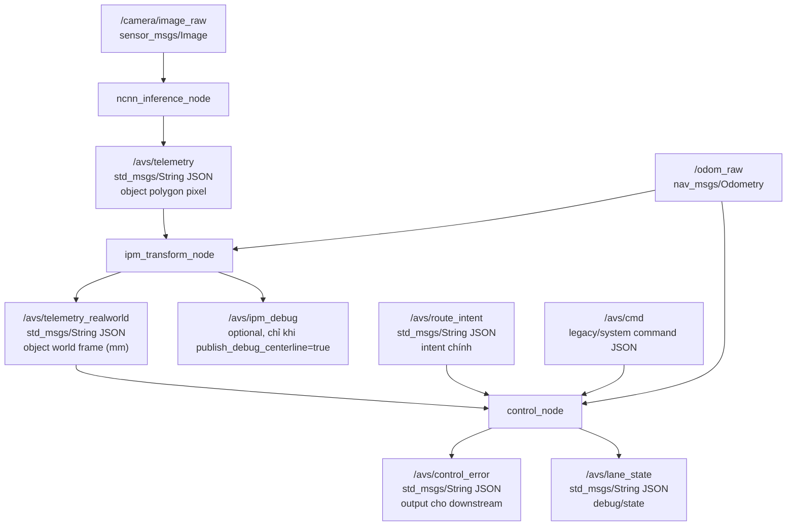
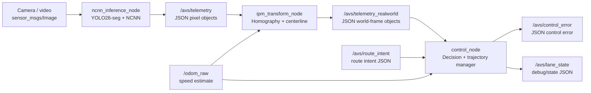

# Chương 1. Tổng quan hệ thống hiện tại

## 1.1. Bài toán mà hệ thống này giải quyết

Hãy hình dung một xe robot nhỏ (AVS) có một camera gắn cố định, nhìn xuống mặt đường phía trước. Nhiệm vụ cuối cùng là mỗi khoảnh khắc phải trả lời được câu hỏi rất cụ thể: **"xe hiện đang lệch khỏi tim làn bao nhiêu, và cần bẻ lái theo hướng nào để quay về đúng làn / rẽ / đổi làn theo ý định đã cho?"**

Trả lời câu hỏi đó không đơn giản như "thấy vạch trắng ở đâu thì bám vào đó", vì:

- Camera nhìn ảnh theo phối cảnh (perspective) — vật ở xa trông nhỏ và bị nén lại, nên toạ độ pixel của một điểm trên mặt đường **không tỉ lệ tuyến tính** với khoảng cách thật của nó tới xe. Muốn tính "lệch bao nhiêu mm" thì bắt buộc phải đổi từ toạ độ ảnh sang toạ độ thực tế trên mặt đường.
- Mô hình nhận diện (segmentation) không phải lúc nào cũng hoàn hảo: có frame mất dấu một làn trong 1-2 khoảnh khắc, có frame mask bị méo, dính vào nhau ở khu vực giao lộ. Nếu hệ thống "tin tuyệt đối" vào từng frame riêng lẻ, xe sẽ giật lái liên tục theo nhiễu.
- Ý định lái (đi thẳng, rẽ trái, rẽ phải, đổi làn) là một quá trình có nhiều bước hình học khác nhau (ví dụ rẽ cần nối từ làn hiện tại sang làn rẽ bằng một đường cong chuyển tiếp), không thể suy ra chỉ từ một điểm dữ liệu tức thời.

Vì vậy hệ thống được thiết kế thành một **chuỗi biến đổi dữ liệu nhiều tầng**, mỗi tầng giải quyết đúng một vấn đề trên, thay vì một hàm "nhìn ảnh ra góc lái" duy nhất:

```
ảnh camera (pixel)
  -> phát hiện + phân vùng làn/vạch kẻ (vẫn là pixel)
  -> đổi sang toạ độ thực trên mặt đường (mm)
  -> rút centerline (đường tim làn) từ vùng hình học đó
  -> chọn/dựng một quỹ đạo (trajectory) duy nhất phù hợp ý định lái
  -> làm mượt quỹ đạo đó qua thời gian, tránh giật khi dữ liệu nhiễu
  -> chốt một quỹ đạo "đang bám" (active trajectory) cho tới khi có lý do đủ mạnh để đổi
  -> rút ra vài con số hình học đơn giản (lệch ngang, lệch dọc, góc, độ cong) cho tầng điều khiển phía dưới
```

Báo cáo này đi từ bước đầu (ảnh camera) đến bước cuối (topic `/avs/control_error`) — tức là toàn bộ phần **perception + decision/planning**, không đụng vào bộ điều khiển động cơ phía sau (PD/Pure Pursuit/ESP32).

## 1.2. Hệ tọa độ dùng trong hệ thống

Sau khi ảnh được đổi sang toạ độ thực, mọi tính toán từ đó về sau đều nằm trong **hệ toạ độ gắn theo xe** (vehicle frame), gốc toạ độ đặt tại vị trí xe/camera chiếu xuống mặt đường:

```text
      Y mm, phía trước xe
      ^
      |
      |
      O----------> X mm, bên phải xe
   gốc toạ độ = vị trí xe
```

- `X > 0`: điểm đang ở bên phải xe. `X < 0`: bên trái xe.
- `Y > 0`: điểm đang ở phía trước xe (càng lớn càng xa).
- Gốc `O = (0, 0)`: vị trí tham chiếu của xe, không đổi theo frame — mọi phép đo trong hệ thống (lệch ngang, khoảng cách lookahead...) đều là "so với xe ngay lúc này", không phải toạ độ tuyệt đối trên bản đồ.

Hai trường `epsilon_x_mm`, `epsilon_y_mm` trong `/avs/control_error` chính là toạ độ `(X, Y)` của một điểm cụ thể phía trước xe — điểm mà bộ điều khiển sẽ dùng làm mục tiêu để lái theo (gọi là điểm lookahead, giải thích kỹ ở chương 2).

## 1.3. Các thành phần runtime

Ba node ROS2 chính nằm trong `ros2_ws/src/avs_perception/src/`, mỗi node phụ trách đúng một tầng biến đổi ở mục 1.1:

| Node | File | Vai trò | Input chính | Output chính |
|---|---|---|---|---|
| `ncnn_inference_node` | `ncnn_inference_node.cpp` | Nhận ảnh, chạy segmentation, trả object dạng polygon pixel | ảnh camera | `/avs/telemetry` |
| `ipm_transform_node` | `ipm_transform_node.cpp` | Đổi polygon pixel sang world frame (mm), trích centerline, fit đường cong | `/avs/telemetry`, `/odom_raw` | `/avs/telemetry_realworld` |
| `control_node` | `control_node.cpp` | Chọn/dựng trajectory theo ý định lái, làm mượt, chốt một trajectory, rút control error | `/avs/telemetry_realworld`, `/avs/route_intent`, `/avs/cmd`, `/odom_raw` | `/avs/control_error`, `/avs/lane_state` |

Hai node phụ khác không nằm trong luồng quyết định chính:

| Node | File | Vai trò |
|---|---|---|
| `video_publisher_node` | `video_publisher_node.cpp` | Phát video/camera giả lập để test offline, thay thế camera thật. |
| `video_test_node` | `video_test_node.cpp` | Chạy inference offline để đo hiệu năng/latency, không publish vào pipeline điều khiển. |

`yolo26_seg.cpp`/`.hpp` không phải một node riêng — đây là thư viện wrapper NCNN mà `ncnn_inference_node` gọi vào để chạy mô hình.

## 1.4. Topic ROS2 chính



Điểm cần nhớ: dữ liệu chỉ "chảy xuôi" một chiều qua ba node. Không node nào phía sau gọi ngược lại node phía trước; mọi phối hợp đều qua topic.

## 1.5. Label mapping hiện tại

Source-of-truth: `config/label_mapping.json` + `models/best_ncnn_model/metadata.yaml`. Khi build, `CMakeLists.txt` chạy script generate ra `label_mapping.hpp` để C++ dùng hằng số thay vì số ma thuật (magic number) rải rác trong code.

Model hiện tại có **22 class** (không phải 19 như bản cũ) — thêm `light_green`, `light_red`, `light_yellow` ở ID 3-5 khiến mọi label cũ từ ID 3 trở lên bị dịch +3 so với model cũ. Các label quan trọng với planning/decision:

| ID | Tên | Vai trò trong pipeline |
|---:|---|---|
| 0 | `dashed-white` | Marking đứt nét; không chặn lane-change. |
| 1 | `dashed-yellow` | Divider vàng "mềm"; lane-change có thể được miễn lọc trong vài điều kiện. |
| 2 | `double-solid-white` | Marking liền nét đôi; chặn lane-change. |
| 6 | `main-lane` | Làn hiện tại/mặc định để bám theo. |
| 7 | `other-lane` | Làn bên cạnh, dùng khi đổi làn. |
| 16 | `solid-white` | Marking liền nét; chặn lane-change. |
| 17 | `solid-yellow` | Divider vàng "cứng"; dùng làm cổng hợp lệ (legality gate). |
| 19 | `stop-line` | Có phát hiện nhưng **hiện không** dùng để kích hoạt rẽ/giao lộ (xem chương 7). |
| 20 | `turn-lane` | Làn rẽ; **đây là ID đúng hiện tại**. |

Bẫy quan trọng nhất của cả repo: **`turn-lane = 20`**, không phải `17` (ID của model 19-class cũ) hay `10`. ID `17` hiện là `solid-yellow`; ID `10` hiện là `sign-no-parking` (biển cấm đỗ) — `sign-stop` giờ là ID `13`, không còn là `10` nữa. Repo từng có một bug hồi quy dùng nhầm `10` làm `turn-lane` trong `ipm_transform_node.cpp` — nếu trong quá trình sửa code thấy chỗ nào so sánh `label == 10` hoặc `label == 17` rồi xử lý như turn-lane, đó chắc chắn là lỗi cần fix chứ không phải hành vi cố ý.

## 1.6. Tư tưởng thiết kế: vì sao có 4 tầng trajectory thay vì bám lane trực tiếp

Đây là điểm khác biệt lớn nhất so với một pipeline lane-following đơn giản, và cũng là phần khó hiểu nhất nếu chỉ đọc code mà không biết trước ý tưởng. Nguyên tắc thiết kế đi theo 4 khái niệm tách bạch, mỗi khái niệm là một "mức độ tin cậy" khác nhau:

```text
path observation        candidate trajectory      normalized trajectory      committed active trajectory
(quan sát hình học        (một đường đi khả thi      (đường vừa dựng được      (đường thực sự được
 thô của frame này,        được dựng ra CHO           trộn/làm mượt với          publish ra
 chưa gắn ý định lái)      Ý ĐỊNH lái hiện tại,       trajectory đang bám        control_error;
                           dựa trên observation       ở frame trước, để          chỉ đổi khi có lý do
                           frame này)                 tránh giật)                đủ mạnh)
```

Vì sao cần tách 4 bước này thay vì chỉ tính trực tiếp trên dữ liệu mới nhất?

- **`path observation`** tách khỏi ý định lái: bước này chỉ trả lời "frame này nhìn thấy những gì" (làn nào, marking nào, ở đâu), không quan tâm xe đang muốn đi thẳng hay rẽ. Nhờ vậy logic "đọc hình học" và logic "ý định lái" không bị trộn vào nhau, dễ debug hơn khi một trong hai phần sai.
- **`candidate trajectory`** là một đề xuất "nếu làm theo ý định lái hiện tại thì đường đi sẽ như thế nào", được tính lại mỗi frame từ `path observation` mới nhất. Nó chưa được tin tưởng ngay — vì một frame riêng lẻ có thể bị nhiễu.
- **`normalized trajectory`**: candidate được so sánh/trộn với trajectory đang bám ở frame trước (nếu cùng loại) để lọc bớt rung giật hình học (một lát cắt polygon lệch nhẹ do nhiễu mask sẽ không làm điểm lookahead nhảy đột ngột).
- **`committed active trajectory`**: một bộ máy trạng thái (`TrajectoryManager`, xem chương 5) quyết định có nên "chốt" trajectory mới này làm active hay không — có thể giữ nguyên trajectory cũ (`HOLD_CURRENT`) nếu sai lệch nhỏ, cập nhật mềm (`UPDATE_CURRENT`), hay chốt hẳn cái mới (`COMMIT_NEW`) nếu ý định lái đổi hoặc sai lệch quá lớn.

**Bất biến quan trọng nhất của toàn hệ thống**: mỗi frame chỉ có **đúng một** active trajectory được publish (gián tiếp, qua các con số trong `/avs/control_error`). Mọi làn/ứng viên khác trong frame đó chỉ là dữ liệu nội bộ, không bao giờ lộ ra ngoài cùng lúc với active trajectory.

## 1.7. Sơ đồ tổng thể



## 1.8. Cách đọc các chương tiếp theo

- Chương 2 (`01_co_so_ly_thuyet.md`) dạy lý thuyết nền — segmentation, homography, centerline, polynomial fit, Bezier, control error — **từ gốc**, kèm ví dụ số. Nên đọc chương này trước nếu chưa quen các khái niệm.
- Chương 3-6 mô tả từng node bám sát code thật, có trích dẫn công thức/ngưỡng số và ví dụ số cụ thể minh hoạ.
- Chương 7 tổng hợp giới hạn, bất biến không được phá vỡ, và checklist debug khi hệ thống chạy sai.
