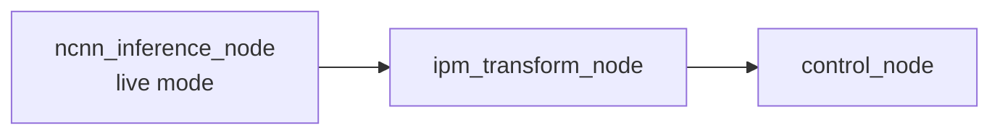

# Chương 3. Thiết kế pipeline runtime

Chương này mô tả pipeline ở mức "lắp ráp" — node nào chạy khi nào, JSON nào chảy giữa các node, và cơ chế build label mapping. Chi tiết thuật toán bên trong từng node nằm ở chương 4-6; chương này chỉ tập trung vào **hợp đồng dữ liệu (data contract)** giữa các node, vì đây là thứ dễ debug sai nhất khi một trường bị thiếu hoặc sai đơn vị.

## 3.1. Pipeline triển khai trong launch

`ros2_ws/src/avs_perception/launch/perception.launch.py` khởi chạy ba node chính theo đúng thứ tự dữ liệu chảy:



Trong `mode=test`, launch chạy `video_test_node` thay cho `ncnn_inference_node` (dùng để đo hiệu năng/profiling offline). Pipeline runtime dùng để điều khiển thực tế luôn là: live inference → IPM → control.

## 3.2. JSON `/avs/telemetry` — đầu ra của `ncnn_inference_node`

Đây là JSON dựng thủ công bằng nối chuỗi (không qua thư viện serialize JSON) — lý do là để tối ưu tốc độ trên CPU Pi 5, nhưng cũng có nghĩa là nếu sửa code build JSON, cần cẩn thận escape/format tay.

Các trường top-level:

| Trường | Ý nghĩa |
|---|---|
| `input_fps` | FPS ảnh đến node (đo từ header stamp hoặc chrono fallback nếu ảnh không có stamp hợp lệ). |
| `processing_fps`, `publish_fps`, `fps` | FPS xử lý/publish; `fps` là alias legacy của `processing_fps`. |
| `bridge_latency_ms` | Thời gian `cv_bridge` chuyển ảnh ROS sang OpenCV Mat. |
| `inference_latency_ms` | Thời gian chạy `YOLO26Seg::detect`. |
| `post_processing_latency_ms` | Thời gian hậu xử lý sau inference (NMS, decode mask...). |
| `contour_time_ms` | Thời gian trích contour + approxPolyDP. |
| `profile_preprocess_ms`, `profile_extractor_ms`, `profile_proposal_ms`, `profile_nms_ms`, `profile_mask_decode_ms` | Breakdown chi tiết hơn của `inference_latency_ms`, đo từng bước con bên trong `YOLO26Seg::detect`. |
| `json_finalize_latency_ms` | Thời gian dựng chuỗi JSON. |
| `publish_latency_ms` | Thời gian gọi publish. |
| `node_total_latency_ms`, `node_processing_latency_ms`, `full_latency_ms` | Tổng thời gian xử lý trong node; `full_latency_ms` là alias legacy của `node_processing_latency_ms`. |
| `output_age_ms`, `last_input_age_ms`, `input_age_ms` | Độ trễ giữa lúc ảnh được chụp và lúc xử lý/publish xong. |
| `streaming` | Cờ cố định `true`, đánh dấu đây là node chạy streaming liên tục. |
| `detections` | Đếm số object theo từng `class_name`. |
| `objects` | Danh sách object đã detect (chi tiết bên dưới). |

> Lưu ý quan trọng về latency: các con số latency của **frame hiện tại** (`json_finalize_latency_ms`, `publish_latency_ms`, `node_total_latency_ms`) chỉ có thể biết chính xác *sau khi* đã publish xong — nên JSON gửi đi thực chất mang giá trị latency đo được của **frame ngay trước đó**, không phải frame đang publish. Đây là chủ đích thiết kế (tránh phải trì hoãn publish để đo xong mới gửi), không phải lỗi.

Mỗi phần tử trong `objects[]`:

```json
{
  "label": 6,
  "prob": 0.91,
  "id": "main_lane_12",
  "track_id": "main_lane_12",
  "class_name": "main-lane",
  "box": [100.0, 200.0, 60.0, 80.0],
  "polygons": [[[100, 200], [160, 200], [160, 280], [100, 280]]]
}
```

`id` và `track_id` luôn giống nhau (cùng lấy từ track_id sinh bởi bước tracking 2D — chương 4). `box` là `[x, y, w, h]` pixel. `polygons` là toạ độ **pixel số nguyên**, đã offset về hệ toạ độ ảnh gốc (không phải toạ độ cục bộ trong ROI mask). Ở stage này mọi toạ độ vẫn là pixel — chưa có ý nghĩa khoảng cách thật.

## 3.3. JSON `/avs/telemetry_realworld` — đầu ra của `ipm_transform_node`

`ipm_transform_node` nhận `/avs/telemetry`, giữ nguyên các trường gốc, và **thêm** các trường world-frame vào từng object trước khi publish `/avs/telemetry_realworld`.

Mọi object (kể cả marking không phải lane) đều được thêm:

| Trường | Ý nghĩa |
|---|---|
| `polygons_real_world` | Polygon sau khi qua homography + clip vùng hợp lệ, đơn vị mm, làm tròn 1 chữ số thập phân. |

Riêng object là lane (`main-lane`, `other-lane`, `turn-lane`) được thêm thêm các trường sau (giải thích công thức ở chương 4):

| Trường | Ý nghĩa | Ghi chú |
|---|---|---|
| `waypoints` | Centerline đã trích + làm mượt, đơn vị mm | Mảng `[x, y]` |
| `polynomial` | Hệ số fit `{a3, a2, a1, a0}` | |
| `lateral_offset_mm` | Lệch ngang tại `y=0` | Luôn `0` với `turn-lane` |
| `longitudinal_offset_mm` | Lệch dọc tại `x=0` | Luôn `0` với `main-lane`/`other-lane` |
| `heading_angle_rad` | Góc hướng cục bộ gần xe | |
| `curvature_inv_mm` | Độ cong cục bộ gần xe | |
| `lookahead_d_mm` | Khoảng lookahead động dùng tại frame này | |
| `lookahead_x_mm` | Giá trị `x` tại điểm lookahead | Luôn `0` với `turn-lane` |
| `lookahead_theta_rad` | Góc hướng tại điểm lookahead | |

**Safeguard quan trọng**: bất kỳ object lane nào trích được **ít hơn 2 waypoint** sẽ bị xoá hoàn toàn khỏi JSON trước khi publish. Lý do: nếu giữ lại, các trường offset ở trên sẽ mang giá trị mặc định `0.0` — downstream (`control_node`) có thể hiểu nhầm đây là phép đo hợp lệ ("làn đang ngay trước xe, lệch 0mm") thay vì "không đủ dữ liệu để đo".

## 3.4. Input của `control_node`

| Topic | Vai trò |
|---|---|
| `/avs/telemetry_realworld` | Input chính chứa lane/marking world frame. |
| `/avs/route_intent` | Nguồn chính cho ý định lái: `follow_main`, `turn_right`, `turn_left`, `lane_change_left`, `lane_change_right`. |
| `/avs/cmd` | Lệnh legacy/system: `arm`, `disarm`, `resume`, `reset`, và các dạng lệnh `turn`/`lane_change` kiểu cũ. |
| `/odom_raw` | Tốc độ tuyến tính chuẩn hoá; quy đổi `linear.x × 2500` ra mm/s (giá trị `1.0` chuẩn hoá ứng với 2.5 m/s). |

`/avs/route_intent` là nguồn intent chính; `/avs/cmd` giữ lại chủ yếu để tương thích ngược và để reset trạng thái hệ thống (arm/disarm/resume/reset), không phải kênh điều hướng chính.

## 3.5. Output của `control_node`

### 3.5.1. `/avs/control_error`

```json
{
  "lane_state": "FOLLOW_MAIN",
  "target_label": 6,
  "epsilon_x_mm": 12.3,
  "epsilon_y_mm": 450.0,
  "theta_rad": 0.027,
  "curvature_inv_mm": 0.000001,
  "lookahead_d_mm": 450.0,
  "trajectory_valid": true,
  "timestamp_ms": 0,
  "control_source": "trajectory_manager"
}
```

`epsilon_x_mm`/`epsilon_y_mm` được làm tròn 1 chữ số thập phân, `theta_rad` làm tròn 3 chữ số thập phân khi publish; `curvature_inv_mm` và `lookahead_d_mm` publish không làm tròn. `timestamp_ms` lấy từ timestamp trong telemetry gốc, không phải giờ hệ thống lúc publish. `target_label` là label cuối cùng trong danh sách nguồn của trajectory (ví dụ `6` = main-lane, `7` = other-lane, `20` = turn-lane); là `-1` nếu trajectory không có nguồn nào.

### 3.5.2. `/avs/lane_state` — debug/state đầy đủ

Đây là topic dùng để **debug**, chứa nhiều thông tin hơn hẳn `/avs/control_error`:

| Trường | Ý nghĩa |
|---|---|
| `decision_state` | State nội bộ hiện tại (`FOLLOW_MAIN`, `TURN_RIGHT`, `TURN_LEFT`, `LANE_CHANGE`, `BLOCKED`, `RECOVERY`). |
| `lane_state` | Tên state kiểu legacy (dùng lại trong `/avs/control_error`). |
| `route_intent` | Ý định lái hiện tại (`current_intent_`). |
| `pending_intent` | Hiện tại luôn bằng `route_intent` — chưa có cơ chế "intent đang chờ xác nhận" tách biệt. |
| `intent_seq` | Số thứ tự (sequence) của intent, dùng để phân biệt các lần gửi intent giống tên nhưng khác lệnh. |
| `intent_age_frames` | Số frame đã trôi qua kể từ khi intent hiện tại được set (reset về 0 khi intent là `FOLLOW_MAIN`). |
| `main_lane_detected`, `other_lane_detected`, `turn_lane_detected`, `stop_line_detected` | Cờ có/không phát hiện từng loại trong frame này. |
| `blocked_by_marking` | Ý định lái hiện tại có đang bị chặn bởi marking (vạch liền/vàng) không. |
| `trajectory_valid` | Active trajectory có hợp lệ không. |
| `timestamp_ms`, `control_source` | Giống `/avs/control_error`. |
| `debug_trajectories` | Mảng debug các stage trajectory (candidate/normalized/committed); chỉ xuất hiện nếu không rỗng. |
| `selected_lane_id` | Track id của lane đang được chọn làm nguồn chính; chỉ xuất hiện nếu không rỗng. |
| `trajectory_kind` | Loại hình học của active trajectory hiện tại. |
| `committed_trajectory_id` | ID nội bộ của trajectory đã chốt. |
| `normalization_mode` | Chế độ normalizer vừa dùng (ví dụ blend, passthrough, kind-mismatch...). |
| `trajectory_confidence` | Độ tin cậy của trajectory đã chốt. |
| `dropout_hold_counter` | Số frame đang giữ trajectory qua tình trạng dropout. |
| `replan_reason` | Lý do quyết định replan/hold gần nhất từ `TrajectoryManager`. |
| `candidate_trajectory_kind` | Loại trajectory ứng viên tính cho ý định lái hiện tại (tính mỗi frame, kể cả khi maneuver chưa được "arm"). |
| `maneuver_dropout_counter` | Số frame liên tiếp không thấy đối tượng mục tiêu của maneuver đang pending. |
| `hold_reason` | Lý do fallback/hold gần nhất ở tầng chính sách của `control_node` (khác với `replan_reason` của manager). |
| `marking_confidence_low` | Cờ báo marking dùng cho legality gate có confidence thấp. |
| `yellow_gate` | Object lồng nhau: `enabled`, `visible`, `age_frames`, `lane_legality` (map trạng thái hợp lệ theo từng lane), `allow_soft_illegal`, `illegal_current_streak`, `legality_return_active`, `route_intent_source` (`"legality_gate"` nếu do cơ chế tự quay về đường hợp lệ sinh ra, `"external"` nếu từ route intent thật). |
| `active_trajectory_points` | Chuỗi điểm của active trajectory, lấy mẫu tối đa 50 điểm (luôn giữ điểm cuối cùng dù stride bỏ qua nó). |
| `turn_latch_active`, `turn_latch_progress_mm`, `turn_latch_length_mm`, `turn_latch_elapsed_s`, `turn_latch_release_reason`, `turn_latch_observed_span_deg`, `turn_latch_extended_span_deg`, `turn_latch_extension_mm`, `turn_latch_deadline_s` | Debug cho cơ chế "frozen turn execution" (`TrajectoryLatch`, chương 6 mục 6.16) — trạng thái latch, tiến độ replay theo odometry, góc quan sát được/đã kéo dài, lý do release, deadline an toàn. |
| `lane_change_gate_debug` | Mảng debug (chỉ populate khi hold vì `lane_change_target_not_detected`) báo cáo 4 hard gate (`side_gate`, `parallel_gate`, `distance_gate`, `corridor_gate`) đang pass/fail cho từng ứng viên `other-lane` — xem chương 6 mục 6.9. |

## 3.6. Build-time label generation

`CMakeLists.txt` tạo `label_mapping.hpp` từ `config/label_mapping.json`:

```text
config/label_mapping.json
-> scripts/generate_label_mapping.py
-> build/include/avs_perception/label_mapping.hpp
```

Nhờ vậy code C++ dùng hằng số có tên (ví dụ `LABEL_TURN_LANE`) thay vì số nguyên rải rác. Khi đổi label, phải đổi đồng bộ: `config/label_mapping.json`, `models/best_ncnn_model/metadata.yaml`, và (nếu liên quan) `tools/local_post_inference_simulator/label_mapping.json` — không sửa một chỗ lẻ trong source, vì `class_names` cứng trong `yolo26_seg.hpp` phải khớp thứ tự tuyệt đối với file config.
