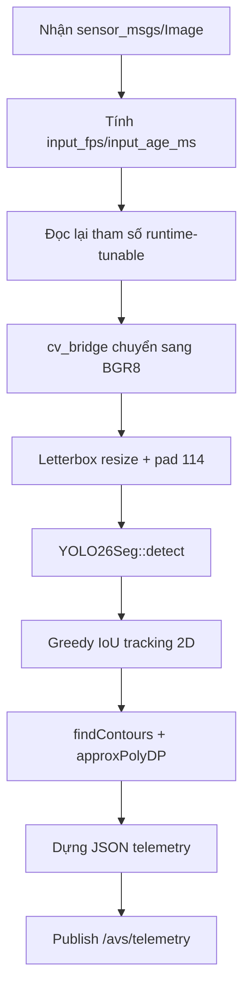

# Chương 4. `ncnn_inference_node`

## 4.1. Vai trò

`ncnn_inference_node` là node đầu tiên của pipeline. Nó nhận ảnh camera, chạy mô hình YOLO26 instance-segmentation qua thư viện NCNN (một thư viện suy luận mạng nơ-ron tối ưu cho CPU/thiết bị nhúng — dùng ở đây vì Raspberry Pi 5 không có GPU đủ mạnh cho các framework nặng hơn như PyTorch/TensorRT), trích contour mask thành polygon, gán track id đơn giản qua các frame, và publish JSON telemetry ở `/avs/telemetry`.

Các khái niệm nền (instance segmentation, decode mask kiểu coefficient+prototype, NMS, IoU, tracking) đã giải thích từ gốc ở chương 2 mục 2.1 — chương này chỉ mô tả cách các khái niệm đó **được cài đặt cụ thể** trong code.

File chính:

- `ros2_ws/src/avs_perception/src/ncnn_inference_node.cpp`
- `ros2_ws/src/avs_perception/src/yolo26_seg.cpp`
- `ros2_ws/src/avs_perception/include/avs_perception/yolo26_seg.hpp`

## 4.2. Tham số ROS2

| Tham số | Mặc định | Ý nghĩa | Đọc lại mỗi frame? |
|---|---:|---|---|
| `model_param_path` | `/workspace/models/best_ncnn_model/model.ncnn.param` | File cấu trúc mạng NCNN | Không (chỉ load lúc khởi tạo) |
| `model_bin_path` | `/workspace/models/best_ncnn_model/model.ncnn.bin` | File trọng số NCNN | Không |
| `prob_threshold` | `0.25` | Ngưỡng confidence giữ detection | **Có** |
| `nms_threshold` | `0.45` | Ngưỡng IoU loại trùng trong NMS | **Có** |
| `input_topic` | `/camera/image_raw` | Topic ảnh đầu vào | Không |
| `output_topic` | `/camera/segmented_image/compressed` | Khai báo nhưng **không được dùng** trong node này (không có publisher tương ứng) — có thể là tham số dự phòng cho một node hiển thị khác chưa/không còn tồn tại | — |
| `num_threads` | `3` | Số thread NCNN | **Có** |
| `target_size` | `320` | Kích thước input vuông đưa vào model (fallback về 320 nếu cấu hình `<=0`) | Không |
| `decode_non_control_masks` | `false` | Có decode mask cho các class không tham gia control (sign/vehicle) hay không | Không |
| `enable_nms` | `true` | Bật/tắt bước NMS | **Có** |
| `max_detections` | `30` | Giới hạn số detection giữ lại khi NMS tắt (hoặc sau postprocess) | **Có** |
| `use_vulkan_compute`, `use_fp16_packed/storage/arithmetic`, `use_packing_layout`, `use_int8_inference` | `false` | Các tối ưu NCNN cấp thấp, truyền qua `NcnnOptions` | Không |

Việc một số tham số được **đọc lại mỗi frame** (không chỉ lúc khởi tạo) có nghĩa là chúng có thể chỉnh qua `ros2 param set` khi node đang chạy, không cần restart — hữu ích khi cần tinh chỉnh `prob_threshold`/`nms_threshold` trực tiếp trong lúc quan sát video thật.

## 4.3. Luồng xử lý trong callback ảnh



Một chi tiết cài đặt đáng chú ý ở bước chuyển ảnh sang OpenCV: nếu buffer ảnh không liên tục trong bộ nhớ (`!isContinuous()`), node copy dữ liệu ra một buffer liên tục thay vì chia sẻ trực tiếp — vì hàm resize của NCNN (`ncnn::Mat::from_pixels_resize`) yêu cầu dữ liệu liền mạch, không có "đệm hàng" (stride padding).

## 4.4. Suy luận NCNN — decode output như thế nào

`YOLO26Seg::detect` (giải thích ý tưởng ở chương 2 mục 2.1.1) thực hiện theo thứ tự:

1. **Letterbox resize** ảnh BGR về `target_size × target_size` (mặc định `320×320`) — KHÔNG phải resize/stretch thường. Giữ nguyên tỉ lệ khung hình gốc: `lb_scale = min(target_size/img_w, target_size/img_h)`, resize theo `lb_scale` rồi pad phần còn thiếu bằng màu xám `114` để lấp đầy khung vuông. Đây là fix chủ đích để khớp đúng phép biến đổi `LetterBox` mà Ultralytics dùng lúc training — trước đây node dùng resize thường (stretch), gây lệch tỉ lệ so với ảnh training và làm giảm accuracy/recall khi chạy trên Pi so với PC (xem chương 7 mục "Pi vs PC" nếu có, hoặc `memory` dự án).
2. Convert BGR → RGB, normalize giá trị pixel về khoảng `[0,1]`.
3. Chạy extractor NCNN, input tên `"in0"`.
4. Lấy hai tensor output:
   - `out0`: chứa box + điểm số theo lớp + hệ số mask, kích thước `(4 + num_classes + 32) hàng × 2100 cột` (2100 = số anchor/vị trí đề xuất; 4 = box `(cx, cy, w, h)`; 32 = hệ số mask). Với model 22-class hiện tại, `out0` là **58 hàng × 2100 cột** (`4+22+32=58`).

     > Quan trọng: `num_classes` **không còn hard-code** trong code — được suy ra động từ chính shape của `out0` (`num_classes = out0.h - 4 - feat_channels`). Kèm theo đó là một safety check: nếu `num_classes` suy ra được không khớp với `class_names.size()` (danh sách tên lớp cấu hình trong `yolo26_seg.hpp`), node log lỗi và `return -1` thay vì chạy tiếp với dữ liệu sai lệch — tức là đổi số lớp trong model mà quên đồng bộ `class_names` sẽ bị chặn ngay ở bước decode, không chạy âm thầm sai.
     > Ghi chú: comment trong code tại vị trí khai báo `out0` vẫn ghi `"(44 x 2100)"` — con số `44` này lỗi thời với **cả** model 19-class cũ (`55`) lẫn model 22-class hiện tại (`58`), đừng lấy `44` làm chuẩn khi đọc/sửa code; số đúng để đối chiếu là `58` (hoặc tổng quát hơn: `4 + num_classes + 32`, suy ra động).
   - `out1`: prototype mask, kích thước `32 kênh × 80 × 80` (32 = số hệ số mask mỗi object, 80×80 = độ phân giải prototype).
5. Với mỗi anchor: tìm lớp có điểm số cao nhất trong `num_classes` lớp (suy ra động, xem trên); nếu điểm số cao nhất `> prob_threshold` thì giữ lại, lấy 4 giá trị box và 32 hệ số mask tương ứng.
6. Sắp xếp toàn bộ đề xuất theo `prob` giảm dần (quicksort thủ công).
7. Chạy NMS nếu `enable_nms = true` (xem 4.5).
8. **Đảo ngược letterbox** để đưa box từ không gian `320×320` về đúng kích thước ảnh gốc: trừ đi offset padding rồi chia cho `lb_scale` (không phải một phép scale đơn giản như resize thường, vì phải bù đúng phần pad đã thêm ở bước 1).
9. Decode mask cho các object cần mask (xem 4.4.1 và 2.1.1).

### 4.4.1. Class nào không decode mask

Khi `decode_non_control_masks = false` (mặc định), các label **bị bỏ qua bước decode mask** để tiết kiệm CPU được xác định **theo tên class, không phải theo ID số** (hàm `class_needs_mask` trong `yolo26_seg.hpp`): mọi tên bắt đầu bằng `"sign-"`, mọi tên bắt đầu bằng `"light_"`, và tên đúng bằng `"vehicle"`. Với model 22-class hiện tại, nhóm này gồm 7 biển báo (`sign-no-left`, `sign-no-parking`, `sign-no-right`, `sign-parking`, `sign-stop`, `sign-turn-left`, `sign-turn-right`), 3 đèn tín hiệu (`light_green`, `light_red`, `light_yellow`), và `vehicle` — tổng 11 class bị skip mask. Các label lane/marking còn lại (`dashed-white`, `dashed-yellow`, `double-solid-white`, `main-lane`, `other-lane`, `parking-zone`, `solid-white`, `solid-yellow`, `start`, `stop-line`, `turn-lane`) luôn được decode mask đầy đủ bất kể tham số này.

Lý do cơ chế đổi từ so khớp theo ID số sang so khớp theo tên (có comment giải thích trong code): tránh việc thêm/đổi thứ tự class trong model (như đợt migrate 19→22 class) vô tình làm lệch khoảng ID và skip nhầm một lane class quan trọng — so khớp theo tiền tố tên bền hơn với việc model đổi số lượng/thứ tự class trong tương lai.

## 4.5. NMS — cài đặt cụ thể

Áp đúng thuật toán đã mô tả ở chương 2 mục 2.1.2, với một điểm cần lưu ý: bước so khớp IoU trong NMS **không phân biệt theo label** một cách tường minh (hàm so khớp mọi cặp bbox bất kể class) — nhưng vì input đưa vào NMS đã được lọc "mỗi anchor chỉ giữ lớp điểm cao nhất", các object khác label thường nằm ở vị trí ảnh khác nhau nên hiếm khi hai object khác loại bị NMS loại nhầm lẫn nhau trên thực tế.

Nếu `enable_nms = false`: bỏ qua bước NMS, chỉ cắt lấy tối đa `max_detections` (mặc định 30) phần tử đầu sau khi đã sort theo `prob`.

## 4.6. Polygon telemetry — từ mask nhị phân ra polygon

Sau khi có mask nhị phân, node dùng OpenCV:

```text
cv::findContours(mask, RETR_EXTERNAL, CHAIN_APPROX_SIMPLE)
cv::approxPolyDP(contour, epsilon=1.5, closed=true)
```

`RETR_EXTERNAL` chỉ lấy đường viền ngoài cùng (bỏ qua lỗ bên trong nếu có — không cần thiết cho lane). `CHAIN_APPROX_SIMPLE` nén các điểm thẳng hàng liên tiếp thành hai đầu mút. `approxPolyDP` xấp xỉ contour bằng đa giác có ít đỉnh hơn nhưng vẫn giữ hình dạng trong sai số `1.5` pixel — giảm số điểm cần lưu/truyền mà không mất hình dạng đáng kể.

Sau đó, toạ độ contour (vốn tính trong hệ toạ độ cục bộ của vùng ROI mask) được cộng thêm offset góc trên-trái của bounding box để đưa về đúng toạ độ trên ảnh gốc đầy đủ. Kết quả ghi vào `objects[*].polygons` — đây chính là dữ liệu hình học mà `ipm_transform_node` sẽ dùng ở chương 5.

## 4.7. Tracking 2D — cài đặt cụ thể

Áp thuật toán greedy-IoU đã mô tả ở chương 2 mục 2.1.4:

1. Với mỗi cặp (detection hiện tại, track cũ) **cùng label**, tính IoU giữa bounding box.
2. Giữ ứng viên có `IoU ≥ 0.3`.
3. Sắp xếp ứng viên giảm dần theo IoU, ghép tham lam: cặp IoU cao nhất còn "trống cả hai phía" được ghép trước.
4. Track ghép được: cập nhật rect, tăng tuổi (`age`), reset bộ đếm mất dấu (`lost_count = 0`).
5. Track không ghép được: tăng `lost_count`.
6. Track bị xoá nếu `lost_count > 5` — tức **mất dấu liên tục hơn 5 frame** (nếu match lại giữa chừng thì bộ đếm reset về 0, không cộng dồn tổng số lần mất dấu).

Track id sinh cho object mới: lấy `class_name`, thay `-` bằng `_`, nối với một counter toàn cục tăng dần, ví dụ `main_lane_0`, `turn_lane_5`. Track id này được giữ nguyên qua nhiều frame miễn còn ghép được — đây là cơ chế giúp `ipm_transform_node` (EMA theo track_id, chương 5) và `control_node` (hysteresis chọn làn, chương 6) "biết" đâu là cùng một làn đang bám dù hình dạng mask hơi khác mỗi frame.

**Ví dụ số** (đã trình bày đầy đủ phép tính ở chương 2 mục 2.1.3): track cũ `main_lane_3` rect `(100,200,60,80)`, detection mới cùng label rect `(110,205,60,80)` → `IoU ≈ 0.641` ≥ ngưỡng `0.3` → ghép, detection giữ nguyên `track_id = main_lane_3` thay vì sinh id mới.

## 4.8. Latency và profiling

Node ghi nhiều metric latency vào telemetry (danh sách đầy đủ ở chương 3 mục 3.2): `bridge_latency_ms`, `inference_latency_ms` (kèm breakdown `profile_preprocess_ms`/`profile_extractor_ms`/`profile_proposal_ms`/`profile_nms_ms`/`profile_mask_decode_ms`), `post_processing_latency_ms`, `contour_time_ms`, `json_finalize_latency_ms`, `publish_latency_ms`, `node_total_latency_ms`, `output_age_ms`. Các metric này không tham gia tính control error — chỉ để đo hiệu năng pipeline trên phần cứng CPU-only Raspberry Pi 5. Lưu ý (đã nêu ở chương 3): các con số latency của chính frame đang publish chưa thể biết trước khi publish xong, nên JSON gửi đi mang giá trị latency đo được ở **frame ngay trước đó** — chủ đích thiết kế, không phải bug.
