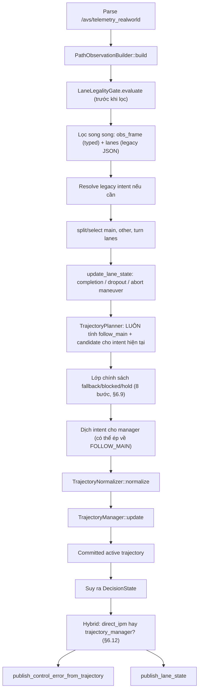

# Chương 6. `control_node` và cách tính `control_error`

## 6.1. Vai trò

`control_node` là lớp decision/planning nằm giữa `/avs/telemetry_realworld` và `/avs/control_error`. Node này **không điều khiển động cơ trực tiếp** — nó chọn/dựng một trajectory duy nhất trong hệ toạ độ xe, làm mượt/chốt trajectory đó qua thời gian (ý tưởng candidate→normalized→committed đã giải thích ở chương 1 mục 1.6 và chương 2 mục 2.9), rồi rút ra vài con số hình học cho tầng điều khiển phía dưới dùng.

Đây là node phức tạp nhất trong hệ thống — chương này là chương dài nhất, chia theo đúng thứ tự xử lý một frame.

File chính:

- `control_node.cpp` — điều phối toàn bộ luồng, state machine, chính sách fallback/blocked/hold, hybrid direct-IPM, publish output.
- `decision_types.hpp` — định nghĩa `DecisionState`, `RouteIntent`.
- `path_observation.hpp` — `PathObservationBuilder`, chuyển JSON thành cấu trúc typed.
- `trajectory_planner.hpp` — dựng `PlannedTrajectory` theo từng ý định lái.
- `trajectory_normalizer.hpp` — trộn/passthrough candidate với trajectory đang bám.
- `trajectory_manager.hpp` — quyết định chốt/giữ/cập nhật active trajectory.
- `legacy_lane_model.hpp` — các hàm hình học kiểu cũ vẫn đang được dùng song song (chọn lane, T-junction, evaluate trajectory tại lookahead).
- `lane_legality.hpp` — luật vạch vàng.

## 6.2. State và intent — hai khái niệm khác nhau, dễ nhầm

Có hai khái niệm cần phân biệt rõ, vì rất dễ nhầm là một:

- **`RouteIntent` (`current_intent_`)**: ý định lái — nguồn "sự thật" duy nhất về việc xe *muốn* làm gì. Chỉ được set bởi `/avs/route_intent` (`route_intent_callback`) hoặc lệnh legacy qua `/avs/cmd` (`cmd_callback`). Giá trị: `follow_main`, `turn_right`, `turn_left`, `lane_change_left`, `lane_change_right`.
- **`DecisionState` (`state_`)**: trạng thái publish ra ngoài (`FOLLOW_MAIN`, `TURN_RIGHT`, `TURN_LEFT`, `LANE_CHANGE`, `BLOCKED`, `RECOVERY`) — đây **không phải nguồn quyết định**, mà là kết quả **suy ra** từ trajectory vừa được chốt ở frame đó:

```text
nếu action == ENTER_RECOVERY hoặc committed trajectory không hợp lệ  → RECOVERY
else nếu đang blocked_by_marking                                     → BLOCKED
else theo trajectory_kind của trajectory đã chốt:
    TURN_RIGHT / TURN_LEFT             → TURN_RIGHT / TURN_LEFT
    LANE_CHANGE_LEFT / LANE_CHANGE_RIGHT → LANE_CHANGE
    FOLLOW_MAIN / BLOCKED_FOLLOW_MAIN / khác → FOLLOW_MAIN
```

Vì `state_` được suy ra từ trajectory đã chốt của **frame này**, còn nhiều bộ đếm/điều kiện trong node lại xét trên trạng thái của **frame trước**, `state_` luôn "trễ" một nhịp so với `current_intent_` vừa nhận. Đây là lý do code có comment cảnh báo rõ: không được dùng `state_` để gate các bộ đếm dropout/abort — phải dùng `current_intent_` trực tiếp.

Legacy `lane_state` (dùng lại trong `/avs/control_error`) gộp bớt các state cho tương thích ngược: `TURN_RIGHT`/`TURN_LEFT` → `TURNING`; `BLOCKED`/`RECOVERY` → `FOLLOW_MAIN`.

## 6.3. Luồng xử lý mỗi frame telemetry



## 6.4. `PathObservationBuilder`

Chuyển object JSON thành cấu trúc typed: `PathObservationFrame`, `LaneObservation`, `MarkingObservation`.

- Lane được nhận nếu label thuộc `{main-lane, other-lane, turn-lane}`.
- Marking được nhận nếu label thuộc `{dashed-white, dashed-yellow, double-solid-white, solid-white, solid-yellow, stop-line}`.
- Điểm của lane lấy từ `waypoints`, được sort và lọc bớt các điểm quá gần nhau (tránh điểm trùng lặp gây lệch trọng số khi tính arc-length sau này).
- Nếu lane thiếu điểm nhưng có `lookahead_x_mm`/`lookahead_d_mm`, nó được đánh dấu `has_precomputed_control = true` — cho phép các bước sau (đặc biệt là control error, §6.13) dùng thẳng giá trị IPM đã tính sẵn thay vì phải suy ra từ chuỗi điểm rời rạc.

Quan trọng: `LaneLegalityGate.evaluate` chạy **ngay sau** bước build này và **trước khi lọc** — nghĩa là gate luôn nhìn thấy đầy đủ mọi lane trong frame (kể cả lane sẽ bị coi là bất hợp lệ) để tính toán, rồi mới áp bộ lọc lên cả `obs_frame` (typed) lẫn `lanes` (JSON kiểu legacy) song song. Nhờ áp lọc song song trên cả hai đường dữ liệu, mọi bước xử lý sau đó (resolve intent, chọn lane, planner, hybrid direct-IPM) đều chỉ nhìn thấy lane đã qua lọc hợp lệ, không có đường "lách" nào bỏ qua gate.

## 6.5. Lane legality gate — luật vạch vàng

`LaneLegalityGate` (lý thuyết PCA + signed distance) xử lý luật vạch vàng theo nguyên tắc:

- `solid-yellow`: lane ở sai phía bị coi là **hard illegal** (luôn bị lọc bỏ, trừ khi được exempt).
- `dashed-yellow`: lane ở sai phía là **soft illegal** — nếu ý định lái hiện tại là lane-change, lane này vẫn có thể được giữ trong tập ứng viên (không bị lọc cứng).
- Lane đang được xe follow hiện tại (theo `last_main_track_id_`) luôn được **exempt** khỏi gate — tránh tình huống xe tự nhiên "mất path" đột ngột chỉ vì vạch vàng bị nhận diện lại khác đi giữa chừng.
- Nếu xe đang ổn định ở một lane bất hợp lệ và có lane hợp lệ gần hơn, cơ chế `LegalityAutoReturn` có thể tự sinh một intent nội bộ (`lane_change_*`) để đưa xe quay về lane hợp lệ — không cần chờ route intent bên ngoài.
- Lane mang label `turn-lane` **luôn được giữ lại trong output đã lọc**, bất kể verdict của gate là gì — verdict vẫn được tính và báo cáo bình thường cho debug, chỉ riêng bước loại bỏ (`filter`/`filter_legacy`) bị bỏ qua cho turn-lane. Lý do: bản chất một turn-lane là dẫn xe **băng qua** vạch phân cách đúng làn hiện tại — bị chấm `ILLEGAL` là chuyện *dự kiến*, không phải lý do để ẩn nó khỏi turn selector (`LegacyLaneModel::select_turn_lane`/`is_turn_commit_ready` cần thấy được candidate này mới hoạt động).

Gate hoạt động bằng cách dùng PCA (Principal Component Analysis — tìm trục chính của một tập điểm) để tìm ra hướng chủ đạo của vạch vàng, "gộp" bề dày marking (vốn là một dải, không phải một đường mảnh) thành một đường centerline mảnh, rồi dùng khoảng cách có dấu (signed distance) từ lane tới đường đó để phân loại:

```text
legal nếu signed_distance < -margin
illegal nếu signed_distance > margin
unknown nếu nằm trong vùng đệm (dead-zone) hoặc gate không áp dụng được
```

## 6.6. Chọn `main_current`/`main_ahead` và phát hiện T-junction

`LegacyLaneModel::split_main_lanes` (mirror JSON của `TrajectoryPlanner::select_main_current`/`select_main_ahead`) chọn `main_current` bằng một điểm số kết hợp:

```text
score = |start_x| + 0.5 × start_y
```

(ưu tiên lane bắt đầu gần centerline xe, và bắt đầu gần xe hơn theo `Y`), cộng thêm **hysteresis**: nếu lane đang xét trùng `last_main_track_id_` (lane đang follow từ frame trước) và `start_y` của nó không lệch quá xa so với lane bắt đầu gần nhất (`start_y - min_start_y ≤ 600mm`), lane đó được cộng thêm `-1500` vào score (tức được ưu tiên chọn lại, tránh nhảy làn liên tục giữa hai lane có điểm số gần bằng nhau do nhiễu).

`main_ahead` chỉ được nối tiếp với `main_current` nếu đồng thời thoả:

- khoảng cách dọc (longitudinal gap) giữa điểm cuối `main_current` và điểm đầu `main_ahead` nằm trong `[-500mm, 2000mm]`,
- lệch ngang (lateral jump) tại điểm nối `< 400mm`,
- chênh lệch hướng (heading difference) `< 30°`.

**Phát hiện T-junction** hoàn toàn dựa vào hình học, **không dùng `stop-line`** (bất biến thiết kế, xem chương 7):

- Chỉ xét khi có `main_current` nhưng **không có** `main_ahead` (đường phía trước "cụt").
- Với mọi ứng viên `turn-lane`, thu thập độ trải rộng theo `X` (`max_turn_x - min_turn_x`) và vị trí `Y` trung bình bắt đầu của chúng.
- Điều kiện hình học một frame: `số turn-lane > 0` VÀ `độ trải rộng theo X > 2000mm` VÀ `|điểm cuối main_current theo Y - Y trung bình bắt đầu turn-lane| < 1500mm`.
- Bộ đếm ổn định `t_junction_counter_` tăng khi điều kiện trên đúng, reset về 0 khi sai; T-junction chỉ được **xác nhận** (`is_t = true`) khi `t_junction_counter_ ≥ 3` — tức cần **3 frame liên tiếp** cùng thoả điều kiện, để tránh false-positive từ một frame nhiễu.
- Một cờ riêng `t_junction_pending` (= điều kiện hình học đúng ở frame này NHƯNG chưa đủ 3 frame để xác nhận) được dùng để ép fallback về `FOLLOW_MAIN` tạm thời trong lúc chờ xác nhận (xem bước 3 ở §6.9) — tránh việc commit vào một maneuver rẽ dựa trên một phát hiện T-junction chưa chắc chắn.

## 6.7. `update_lane_state` — hoàn thành / mất dấu / huỷ giữa chừng một maneuver

Đây là phần thực sự "ghi" lại `current_intent_` (ngoài việc nhận trực tiếp từ topic) — xử lý vòng đời của một maneuver (rẽ/đổi làn) đang thực hiện dở.

### 6.7.1. Hoàn thành maneuver

- **Rẽ (turn) hoàn thành** khi đồng thời: góc còn lại `|theta_t| < theta_done_rad` (mặc định `0.1 rad ≈ 5.7°`) VÀ lệch dọc `long_off < -turn_done_mm` (mặc định `-200mm`, nghĩa là xe đã **đi qua** điểm rẽ khoảng 200mm). Khi hoàn thành, intent tự reset về `follow_main`, `seq = 0`.
- **Đổi làn (lane-change) hoàn thành** dùng một điều kiện hình học khác hẳn rẽ: `|target_x| < 250mm` (xe đã lệch đủ gần tim làn đích) — `target_x` lấy từ `lookahead_x_mm` của làn đích hoặc điểm `waypoints[0].x` nếu không có. Nếu chưa thoả điều kiện trên nhưng có `main_current`, còn một cách phát hiện hoàn thành thứ hai: kiểm tra **làn đối diện** (làn cũ, giờ đã ở phía bên kia) — nếu đang đổi sang trái và `other_lane` bên phải có `x > 600mm` trong khi `main_current` đã nằm trong khoảng `(-250mm, 250mm)` (tương tự đối xứng cho đổi sang phải) → cũng coi là hoàn thành. Đây là cách bắt được trường hợp "xe đã thực sự sang làn mới" ngay cả khi làn đích không còn được track ổn định tại đúng khoảnh khắc đó.

### 6.7.2. Mất dấu (dropout) và huỷ giữa chừng (abort)

Cơ chế đếm mất dấu chỉ được "vũ trang" (armed) sau khi đã **thấy** đối tượng mục tiêu của maneuver liên tục đủ `kIntentArmSeenFrames = 5` frame kể từ lúc nhận intent — tránh đếm dropout ngay từ frame đầu tiên khi target còn chưa kịp xuất hiện.

Khi đã armed, nếu target biến mất:

- `maneuver_dropout_counter_` tăng dần mỗi frame không thấy target.
- Vượt `maneuver_dropout_hold_frames_` (mặc định `10`) nhưng chưa vượt ngưỡng abort → chỉ ghi `hold_reason_ = "maneuver_dropout_hold_exceeded"`, intent **vẫn giữ nguyên** (chờ target xuất hiện lại).
- Vượt `intent_abort_frames_` (mặc định `30`) → **huỷ cứng**, ép intent về `follow_main`, `hold_reason_ = "intent_aborted_dropout"`.

Cùng cơ chế abort (ngưỡng `intent_abort_frames_ = 30`) cũng áp dụng cho trường hợp maneuver bị **chặn bởi marking** liên tục (`blocked_intent_counter_`, tăng mỗi frame `blocked_maneuver = true`, xem bước 7 ở §6.9) — khi vượt ngưỡng, huỷ cứng intent với `hold_reason_ = "intent_aborted_blocked"`, độc lập với đường dropout ở trên.

## 6.8. `TrajectoryPlanner` — dựng candidate theo từng ý định lái

Một chi tiết cần lưu ý: `plan_follow_main` **luôn được tính mỗi frame bất kể ý định lái hiện tại là gì** — đây chính là candidate "dự phòng" (fallback) mà lớp chính sách ở §6.9 dùng khi cần ép trở lại đi thẳng. Song song, `plan_candidate_for_intent` tính candidate thật sự tương ứng với `current_intent_` — kể cả khi maneuver đó chưa được "arm"/chưa đủ điều kiện commit (candidate này vẫn được tính ra chỉ để phục vụ trường debug `candidate_trajectory_kind`).

Logic dựng candidate theo từng intent:

- **`follow_main`**: chọn `main_current`, nối `main_ahead` nếu thoả điều kiện ở §6.6; nếu điểm bắt đầu của `main_current` nằm quá xa phía trước xe (không có dữ liệu đoạn gần xe), dựng thêm một đoạn "bridge" từ gốc toạ độ xe tới điểm bắt đầu đó — tránh để trajectory "trống" đoạn gần xe nhất, đoạn quan trọng nhất cho lookahead ngắn.
- **`turn_right`/`turn_left`**: chọn ứng viên `turn-lane` phù hợp — rẽ phải ưu tiên ứng viên **gần hơn**, rẽ trái ưu tiên ứng viên **xa hơn** (phản ánh việc rẽ trái thường cần đi qua/băng ngang nhiều không gian giao lộ hơn); nếu có `main_current`, dựng đoạn chuyển tiếp (transition) bằng Bezier từ `main_current` sang `turn-lane` đã chọn (lý thuyết Bezier — chương 2 mục 2.8).
- **`lane_change_left`/`lane_change_right`**: chọn `other-lane` đúng phía; kiểm tra hành lang (corridor) giữa hai lane có bị marking liền nét chặn không (nếu có, đánh dấu `blocked_by_marking` trên chính candidate — dùng ở bước 2 của §6.9); dựng transition Bezier từ `main_current` sang `other-lane` đã chọn.

Với mọi transition Bezier: điểm điều khiển `P1`/`P2` đặt theo hướng tiếp tuyến tại điểm nối (đảm bảo không gãy góc — chương 2 mục 2.8.2); sau khi có đường cong, path được resample lại theo arc-length, mặc định mỗi `100mm` (chương 2 mục 2.8.3).

## 6.9. Lớp chính sách fallback / blocked / hold

Đây là một tầng trung gian nằm **giữa** `TrajectoryPlanner` và `TrajectoryNormalizer`, quyết định candidate cuối cùng nào sẽ thực sự được đưa vào normalizer — không phải lúc nào candidate của `plan_candidate_for_intent` cũng được dùng thẳng. Các bước được kiểm tra **theo đúng thứ tự sau**, mỗi bước có thể set các cờ `should_use_follow_main_fallback` / `force_follow_main_commit` / `blocked_by_marking` / `hold_reason_`:

1. **Rẽ trái tại T-junction đã xác nhận, kiểm tra chặn bởi vạch liền trước**: nếu intent là `turn_left`, `is_t` đã xác nhận, và candidate hợp lệ — dựng thử một trajectory tạm từ candidate rồi kiểm tra có bị `is_turn_blocked_by_solid` (marking liền nét chắn ngang) không → nếu có, `blocked_maneuver = true`. Chỉ áp dụng cho rẽ trái (không áp cho rẽ phải), vì rẽ trái tại T-junction thường phải băng qua làn ngược chiều — rủi ro cao hơn hẳn.
2. **Đổi làn bị chặn bởi marking**: nếu intent là lane-change và candidate đã tự đánh dấu `blocked_by_marking` (từ bước kiểm tra corridor ở §6.8) → `blocked_maneuver = true`.
3. **T-junction chưa xác nhận (pending)**: intent là rẽ, `t_junction_pending = true`, có `main_current` → fallback về follow_main **và** ép commit ngay (`force_follow_main_commit`), `hold_reason_ = "t_junction_pending"`.
4. **Rẽ nhưng chưa vào đúng tầm**: maneuver đang pending, chưa từng commit, intent là rẽ, và điểm rẽ chưa đủ gần (`long_off ≥ turn_proximity_mm_`, mặc định `500mm`) → chỉ fallback (không ép commit), `hold_reason_ = "turn_not_in_range"`.
5. **Đổi làn nhưng chưa phát hiện làn đích**: maneuver pending, chưa từng commit, intent là lane-change, không bị blocked, và không tìm được `other-lane` phù hợp → chỉ fallback, `hold_reason_ = "lane_change_target_not_detected"`.

   Khi rơi vào hold này, `LegacyLaneModel::diagnose_other_lane_gates` chạy debug-only trên mọi ứng viên `other-lane` trong frame, báo cáo rõ **gate nào** trong 4 hard gate của `select_other_lane` đang chặn từng ứng viên (không đổi lựa chọn thật, chỉ để debug tại sao lane-change "thấy `other_lane_detected=true` mà vẫn không tìm được target"):

   - `side_gate`: lệch ngang đúng phía đổi làn không (`lateral_dist ≤ -200mm` cho đổi trái, `≥ 200mm` cho đổi phải).
   - `parallel_gate`: chênh lệch heading với main-lane `≤ 30°`.
   - `distance_gate`: khoảng cách ngang tuyệt đối nằm trong `[400mm, 1400mm]`.
   - `corridor_gate`: điểm gần xe nhất của lane (`min_y_mm`) `≤ 1200mm` (đủ gần để coi là hành lang đổi làn hợp lệ, không phải một lane xa phía trước).

   Kết quả publish qua field `lane_change_gate_debug` (mảng JSON, mỗi phần tử gồm `lane_id`, 4 cờ pass/fail, `all_gates_pass`, và các giá trị số góc/khoảng cách dùng để tính) trên `/avs/lane_state` — chỉ populate khi đang hold ở lý do trên, rỗng các trường hợp khác.
6. **Mất dấu target đã vượt ngưỡng hold** (nhưng maneuver **đã** từng commit): `maneuver_dropout_counter_ > maneuver_dropout_hold_frames_` (10) → fallback **và** ép commit, `hold_reason_ = "maneuver_dropout_hold_exceeded"` (nếu chưa được set bởi bước khác).
7. **Áp dụng cờ blocked từ bước 1/2**: nếu `blocked_maneuver` — set `blocked_by_marking = true`, fallback + ép commit, `hold_reason_ = "blocked_by_marking"`, tăng `blocked_intent_counter_`; ngược lại reset bộ đếm này về 0.

   Nếu một frozen turn (§6.16) đang active và bị chặn bởi marking ở đây, latch bị giải phóng ngay lập tức (`latch_blocked_by_marking`) trước khi fallback follow_main được áp — luật vạch liền nét luôn thắng latch.
8. **Huỷ cứng vì bị chặn quá lâu**: `blocked_intent_counter_ > intent_abort_frames_` (30) → reset hẳn intent về `follow_main`, fallback + ép commit, `hold_reason_ = "intent_aborted_blocked"`.

Nếu `should_use_follow_main_fallback` được set ở bất kỳ bước nào, candidate cuối cùng bị **thay thế toàn bộ** bằng candidate `follow_main` (đã tính sẵn ở §6.8); nếu đồng thời đang bị blocked, `trajectory_kind` của candidate đó được ghi đè thành `BLOCKED_FOLLOW_MAIN` kèm `blocked_by_marking = true` ngay trên struct — nhờ vậy cả normalizer lẫn manager phía sau đều nhận biết được tình trạng "đang bị chặn" bất kể nó phát sinh từ bước nào ở trên.

**Dịch intent cho manager**: intent thực sự truyền vào `TrajectoryManager::update` không nhất thiết là `current_intent_` — nếu `force_follow_main_commit` được set, hoặc đang fallback nhưng maneuver chưa từng commit, `manager_intent` bị ép về `follow_main` với `seq=0`. Nhờ tách riêng biến này, cái nhìn của manager về "ý định lái" không bị trộn lẫn với route-intent latch trong lúc một maneuver mới chỉ đang "chờ" mà chưa thực sự bắt đầu.

## 6.10. `TrajectoryNormalizer`

Áp đúng lý thuyết ở chương 2 mục 2.9 phần "chuẩn hoá":

- Không có trajectory trước đó → passthrough (dùng thẳng candidate).
- Candidate invalid → passthrough invalid.
- `trajectory_kind` khác trajectory đang bám → passthrough, **không trộn** hai loại hình học khác nhau (ví dụ đang follow_main mà candidate là turn_left thì không có ý nghĩa để nội suy trộn giữa hai đường khác bản chất).
- Cùng `trajectory_kind` → căn chỉnh theo arc-length rồi trộn có trọng số, trọng số nghiêng dần về candidate mới khi đi xa dần theo `s` và theo độ tin cậy (`confidence`) của candidate:

```text
normalized(s) = w_prev(s) × previous(s) + w_cur(s) × candidate(s)
```

Sau khi trộn, normalizer kiểm tra tính liên tục (continuity) của kết quả: nếu góc thay đổi đột ngột (heading jump) hoặc lệch ngang đột ngột (lateral jump) vượt ngưỡng, nó thử "vá" bằng một đoạn Bezier cục bộ; nếu vẫn không sửa được, candidate bị đánh dấu invalid để `TrajectoryManager` xử lý tiếp (thường dẫn tới `HOLD_CURRENT` hoặc `ENTER_RECOVERY`).

Khi nối phần đuôi không trộn được (ví dụ candidate/previous có độ dài điểm khác nhau sau khi trộn phần chung): chỉ nối thêm đuôi của **candidate mới** nếu nó dài hơn phần chung (perception tươi, an toàn để mở rộng theo). Nếu ngược lại — path trước đó dài hơn (lane view frame này bị co lại vì nhiễu/che khuất/sai số IPM theo khoảng cách) — đuôi thừa của path cũ **không được nối thêm nữa**: đó là hình học chưa trộn của một frame trước, candidate hiện tại không còn hỗ trợ, nối vào sẽ tạo ra một "đuôi cũ" (stale tail) chiếu ra ngoài vị trí lane thực tế đang quan sát. Committed path được phép co lại thay vì giữ đuôi cũ.

## 6.11. `TrajectoryManager`

Quyết định hành động cuối cùng trên trajectory đã chuẩn hoá, bằng một tập chỉ số so sánh giữa trajectory đang bám (previous) và candidate đã normalize (current), căn chỉnh theo arc-length: **lateral RMS**, **heading RMS**, **curvature delta**, **overlap ratio** (tỉ lệ phần trùng khít giữa hai đường), và cờ `topology_changed` (có đổi `trajectory_kind` không).

Bốn hành động khả dĩ:

- **`ENTER_RECOVERY`**: không có trajectory hợp lệ nào để dùng.
- **`HOLD_CURRENT`**: giữ nguyên trajectory cũ — dùng khi sai lệch đủ nhỏ hoặc đang trong giai đoạn dropout tạm thời (candidate không hợp lệ nhưng chưa quá lâu).
- **`COMMIT_NEW`**: chốt hẳn trajectory mới — khi ý định lái đổi, khi `topology_changed`, khi sai lệch quá lớn, hoặc khi bị buộc đổi vì lý do blocked-by-marking.
- **`UPDATE_CURRENT`**: cập nhật mềm — candidate hợp lệ, cùng loại hình học, sai lệch ở mức vừa phải (không đủ nhỏ để hold, không đủ lớn để buộc phải commit-new).

Tham số ngưỡng chính: `maneuver_dropout_hold_frames`, `replan_lateral_rms_mm`, `hold_lateral_rms_mm`, `min_overlap_ratio`, `replan_min_confidence`, `low_conf_hold_frames`. Khi trajectory được giữ nguyên (`HOLD_CURRENT`) trong cùng một `trajectory_kind`, danh tính lane đang bám (`target_lane_id`, `source_lane_ids`, `progress_s_mm`) được **giữ nguyên từ trajectory cũ** thay vì lấy theo candidate mới — chỉ hình học (polyline) được refresh theo candidate. Đây là cơ chế giữ "danh tính lane" liên tục dù polyline thực tế được replan nhẹ mỗi frame.

## 6.12. Hybrid: `direct_ipm` vs `trajectory_manager`

Đây là một tối ưu để giảm trôi dạt (drift) trên các đoạn đường thẳng: khi không có maneuver nào đang chờ xử lý và state hiện tại là `FOLLOW_MAIN`/`BLOCKED`/`RECOVERY`, node có thể **bỏ qua** trajectory đã chốt bởi manager và dùng thẳng lookahead do `ipm_transform_node` đã tính sẵn trên `main_current` (nhẹ hơn, và không mang theo độ trễ của bộ lọc chuẩn hoá/manager).

Điều kiện chính xác:

```text
use_direct_lookahead = false
nếu !maneuver_pending VÀ state ∈ {FOLLOW_MAIN, BLOCKED, RECOVERY}:
    nếu main_current có lookahead_x_mm VÀ lookahead_d_mm VÀ lookahead_d_mm nằm TRONG khoảng [waypoint đầu, waypoint cuối] (không phải ngoại suy):
        nếu KHÔNG có main_ahead:
            use_direct_lookahead = true
        ngược lại (có main_ahead, tức đã có trajectory nối tiếp từ manager):
            so sánh giá trị direct-IPM với giá trị trên active trajectory tại đúng lookahead_d:
                lệch ngang     < 100mm
                lệch góc       < 0.05 rad (~3°)
                lệch độ cong   < 1e-5
            use_direct_lookahead = cả 3 điều kiện trên đều đúng
```

Hai chi tiết quan trọng dễ hiểu nhầm:

- **Việc `main_ahead` tồn tại không tự động loại bỏ direct-IPM** — nó chỉ kích hoạt bước so khớp 3 chỉ số ở trên; nếu cả 3 đều khớp, hệ thống vẫn ưu tiên dùng direct-IPM (ổn định hơn) ngay cả khi đã có một trajectory nối tiếp khả dụng từ manager. Chủ đích thiết kế: giữ sự ổn định của IPM trên đoạn đường thẳng/đã được phân đoạn tốt, chỉ nhường quyền cho trajectory manager khi thực sự đang vào khúc cua/giao lộ (khi đó 3 chỉ số sẽ lệch nhau đủ để phát hiện).
- **Điều kiện "lookahead nằm trong khoảng waypoint"** (`direct_lookahead_within_span`) là một guard sửa lỗi hồi quy thực tế: nếu bỏ qua kiểm tra này, khi `lookahead_d_mm` vượt ra ngoài đoạn dữ liệu đo được, việc evaluate polynomial bậc 3 tại điểm đó trở thành **ngoại suy** (extrapolation) — với các hệ số bậc cao, ngoại suy xa có thể "nổ" thành giá trị vô lý (từng ghi nhận `epsilon_x` lệch tới 13-15 mét giữa khu vực giao lộ trên video thật trước khi có guard này).

Nếu `use_direct_lookahead = true`, node dựng một `ActiveTrajectory` "tổng hợp" (bản sao của trajectory đang active, gắn thêm cờ dùng giá trị precomputed) mang thẳng các trường lookahead từ IPM, rồi publish với `control_source = "direct_ipm"`. Ngược lại, dùng thẳng trajectory thật đã chốt bởi manager, publish với `control_source = "trajectory_manager"`.

## 6.13. Cách tính `/avs/control_error`

Hàm `publish_control_error_from_trajectory` thực chất chỉ có **2 nhánh** (không phải 3 như có thể hiểu nhầm — trường hợp "invalid" chỉ là giá trị mặc định khi không rơi vào nhánh nào, không phải một nhánh xử lý riêng):

```text
nếu trajectory.valid VÀ trajectory.has_precomputed_control:
    epsilon_x = trajectory.precomputed_epsilon_x_mm
    epsilon_y = trajectory.precomputed_epsilon_y_mm
    theta     = trajectory.precomputed_theta_rad
    curv      = trajectory.precomputed_curvature_inv_mm
    lookahead = trajectory.precomputed_lookahead_d_mm

ngược lại nếu trajectory.valid VÀ có ít nhất 1 điểm:
    params = evaluate_trajectory_at_lookahead(trajectory, lookahead_d_mm)
    epsilon_x = params.point.x ; epsilon_y = params.point.y
    theta = params.theta ; curv = params.curvature

(không rơi vào nhánh nào ở trên — trajectory invalid hoặc valid nhưng rỗng điểm):
    epsilon_x = epsilon_y = theta = curv = 0.0  (giá trị mặc định đã khởi tạo sẵn, publish kèm trajectory_valid=false)
```

### 6.13.1. `evaluate_trajectory_at_lookahead` — từng bước

1. Dựng "đường ảo" bằng cách thêm điểm gốc `(0,0)` (vị trí xe) vào đầu chuỗi điểm của trajectory.
2. Đi dọc theo từng đoạn (segment), cộng dồn độ dài cung (`cumulative_dist`), tìm đúng đoạn chứa `lookahead_d_mm`.
3. Nội suy tuyến tính điểm mục tiêu trên đoạn đó theo tỉ lệ `ratio = (lookahead_d_mm - cumulative_dist) / độ_dài_đoạn` (kẹp trong `[0,1]`).
4. Nếu toàn bộ đường ngắn hơn `lookahead_d_mm`, kẹp điểm mục tiêu ở điểm cuối cùng của đường (không ngoại suy thêm).
5. `theta = atan2(target.x, target.y)` (giữ `0` nếu điểm mục tiêu gần trùng gốc toạ độ trong sai số `1e-3`).
6. Nếu đường có ít nhất 3 điểm: lấy 3 điểm lân cận quanh điểm mục tiêu (chỉ số được kẹp trong phạm vi hợp lệ của mảng điểm), tính độ dài 3 cạnh tam giác tạo bởi chúng (`a, b, c`), và tích có hướng (`cross`) giữa hai cạnh liên tiếp, rồi:

```text
curvature = 2 × cross / (a × b × c)
```

Đây là công thức **độ cong Menger** (Menger curvature) — một cách tính độ cong xấp xỉ của một đường cong chỉ từ 3 điểm rời rạc, không cần biết phương trình tường minh của đường cong đó: giá trị càng lớn nghĩa là 3 điểm càng "vòng cung gấp", bằng 0 nếu 3 điểm thẳng hàng.

### 6.13.2. Làm tròn khi publish

`epsilon_x_mm`/`epsilon_y_mm` làm tròn 1 chữ số thập phân, `theta_rad` làm tròn 3 chữ số thập phân; `curvature_inv_mm` và `lookahead_d_mm` publish không làm tròn.

## 6.14. Output JSON cuối cùng

Danh sách đầy đủ field của `/avs/control_error` và `/avs/lane_state` đã liệt kê ở chương 3 mục 3.5 — không lặp lại ở đây để tránh hai nguồn có thể lệch nhau khi cập nhật sau này.

## 6.15. Hai kịch bản minh hoạ quyết định của `TrajectoryManager`

### 6.15.1. Kịch bản A — `HOLD_CURRENT` (giữ nguyên vì sai lệch nhỏ)

Xe đang `FOLLOW_MAIN` ổn định, trajectory đã chốt còn `progress_s_mm` ở giữa đường, `remaining_s_mm ≈ 3000mm`. Frame mới không có route intent nào tới (`current_intent_` vẫn `follow_main`). Planner tính lại `plan_follow_main` với **cùng `track_id`** cho `main_current` (nhờ hysteresis ở §6.6, vì `last_main_track_id_` vẫn khớp) → candidate gần như giống frame trước, chỉ lệch nhẹ do nhiễu mask/IPM (giả sử lệch ngang trung bình ~15mm). Normalizer trộn êm với trajectory trước (không vi phạm continuity).

Manager tính chỉ số: `topology_changed = false` (cùng `FOLLOW_MAIN`), `overlap_ratio ≈ 0.97` (cao), `lateral_rms_mm ≈ 15mm`. So với ngưỡng `hold_lateral_rms_mm` (mặc định `50mm`) và điều kiện còn đủ quãng đường phía trước (`remaining_s_mm=3000 > hold_min_remaining_s_mm`, mặc định `500mm`) → cả hai điều kiện đúng → **`HOLD_CURRENT`**, lý do `"deviation_below_threshold"`. Danh tính lane (`target_lane_id`, `progress_s_mm`) được giữ từ trajectory cũ; chỉ hình học polyline được refresh nhẹ theo candidate mới. `state_` vẫn `FOLLOW_MAIN`; nếu điều kiện hybrid ở §6.12 thoả, `control_source = "direct_ipm"`, ngược lại `"trajectory_manager"`.

### 6.15.2. Kịch bản B — `COMMIT_NEW` (đổi ý định lái)

Xe đang `FOLLOW_MAIN` (`committed_intent = follow_main`). Một message `/avs/route_intent` mới tới: `{"intent": "turn_left", "seq": 7}` → `route_intent_callback` set `current_intent_ = turn_left`, `current_intent_seq_ = 7`, và reset toàn bộ bộ đếm liên quan (`current_intent_age_frames_`, `blocked_intent_counter_`, `maneuver_dropout_counter_`, cờ "đã thấy target"...) — một route intent thật luôn ghi đè, kể cả nếu trước đó `LegalityAutoReturn` (§6.5) đang tự lái nội bộ.

Frame kế tiếp: có `turn-lane` bên trái được phát hiện, giả sử `longitudinal_offset_mm = 350mm` — nhỏ hơn ngưỡng `turn_proximity_mm_` (500mm), tức đã "đủ gần" để commit (bước 4 ở §6.9 không kích hoạt). Planner dựng candidate `turn_left` thật (Bezier nối `main_current` sang `turn-lane`), `trajectory_kind = TURN_LEFT`, hợp lệ. Vì không bước nào ở §6.9 kích hoạt fallback, `manager_intent = turn_left`, `seq = 7`.

Normalizer: `trajectory_kind` mới (`TURN_LEFT`) khác trajectory đang chốt (`FOLLOW_MAIN`) → **passthrough**, không trộn hai loại hình học khác nhau. Manager: `committed_intent (follow_main) ≠ manager_intent (turn_left)` → **`COMMIT_NEW`**, lý do `"intent_changed_to_turn_left"`. `progress_s_mm` reset về 0, hình học lấy toàn bộ từ candidate mới.

`state_` được suy ra: `trajectory_kind` của trajectory vừa chốt là `TURN_LEFT` → `state_ = TURN_LEFT`. Điều kiện hybrid ở §6.12 kiểm tra `!maneuver_pending` trước tiên — vì đang có maneuver rẽ pending, điều kiện này sai ngay → **không bao giờ dùng `direct_ipm` trong lúc một maneuver đang chờ xử lý** → `control_source = "trajectory_manager"`, và `publish_control_error_from_trajectory` chạy qua `evaluate_trajectory_at_lookahead` trên chuỗi điểm của trajectory rẽ vừa chốt (hoặc dùng thẳng giá trị precomputed nếu `turn-lane` mang sẵn `lookahead_x_mm`/`lookahead_d_mm`).

## 6.16. Frozen turn execution — `TrajectoryLatch`

Vấn đề: khi xe tiến vào giao lộ để rẽ, đúng lúc gần tới điểm rẽ nhất thì vạch `turn-lane` lại ra khỏi trường nhìn/BEV (bị camera hoặc góc quan sát che khuất), và mọi candidate mới từ trong giao lộ chỉ còn là các path `follow_main` băng thẳng qua bên kia — nếu để planner replan bình thường, xe sẽ đi thẳng qua giao lộ thay vì rẽ.

Giải pháp (`trajectory_latch.hpp` + `update_turn_latch` trong `control_node.cpp`): khi một turn đã **commit** (turn-lane từng vào trong `turn_proximity_mm`) rồi biến mất, path rẽ cuối cùng còn quan sát được bị "đóng băng" (latch) và được replay open-loop theo odometry cho tới khi dùng hết, thay vì replan theo candidate follow_main mới.

### Điều kiện latch (`update_turn_latch`, chạy TRƯỚC `update_lane_state` mỗi frame)

Chỉ latch khi: intent hiện tại là `turn_left`/`turn_right`, `turn_lane_cand == nullptr` (turn-lane vừa mất), `committed_state_.committed_intent == current_intent_` (turn đã thực sự commit, không phải còn đang chờ vào tầm — dùng chung ngưỡng `turn_proximity_mm_`), và `committed_state_.trajectory.valid`.

### Kéo dài path bằng cung tròn (`TrajectoryLatch::extend_to_turn_angle`)

Camera thường chỉ quan sát được 40-60° trong 90° của một khúc cua (giao lộ vuông góc). Nếu chỉ replay đúng phần quan sát được, xe dừng lại ở giữa khúc cua, hướng lệch quá nhiều để perception nhận lại `main-lane` mới — kẹt vĩnh viễn. Giải pháp: fit một đường tròn qua 3 điểm ở đuôi path quan sát được (cửa sổ `800mm`), rồi kéo dài cung đó tới đúng `turn_latch_target_heading_deg` (mặc định `90°`, dấu theo hướng rẽ), cộng thêm một đoạn thẳng "run-out" (`turn_latch_runout_mm`, mặc định `700mm`) để pure pursuit không bị "làm phẳng" lệnh lái ở đoạn cuối. Bán kính cung bị kẹp trong `[turn_latch_min_radius_mm=800, turn_latch_max_radius_mm=4000]`; nếu góc quan sát được nhỏ hơn `turn_latch_min_observed_span_deg` (mặc định `15°`) hoặc cung đi ngược hướng rẽ, path được trả về **nguyên trạng, không kéo dài** (không bao giờ "bẻ cong" một path thẳng thành rẽ giả).

### Replay theo odometry (`TrajectoryLatch::re_express`)

Mỗi frame trong lúc latch active: `turn_latch_progress_mm_ += current_speed_mms_ * dt`. Path được "tái biểu diễn" (`re_express`) sang hệ toạ độ xe tại đúng vị trí `progress_mm` đó, dưới giả định **bám hoàn hảo** (perfect tracking) — hướng xe được suy ra thẳng từ tiếp tuyến path tại điểm đó, KHÔNG dùng cảm biến yaw nào. Hệ quả: sai lệch bám đường thực tế trong lúc latch là **vô hình** đối với hệ thống (không tự sửa được drift tích luỹ) — chấp nhận được cho một khúc cua 1-3 giây, nhưng không phù hợp nếu latch kéo dài hơn.

### Giải phóng latch (`release_turn_latch`)

Bốn lý do release: `latch_path_consumed` (đi hết path), `latch_timeout` (backstop wall-clock, xem dưới), `latch_blocked_by_marking` (marking liền nét cấm rẽ trái phát hiện trong lớp chính sách §6.9 bước 1 vẫn được ưu tiên cắt ngang latch — luật giao thông luôn thắng latch), và trường hợp path cạn hẳn dù chưa đủ `progress_mm` (path có đoạn suy biến). Khi release: intent bị ép thẳng về `follow_main`, mọi bộ đếm liên quan maneuver (`maneuver_dropout_counter_`, `blocked_intent_counter_`, "đã thấy target"...) reset — **không** dùng `hold_reason_` để lưu lý do release (vì `telemetry_callback` xoá `hold_reason_` mỗi frame trước khi latch kịp publish), mà dùng field riêng `turn_latch_release_reason_`, giữ nguyên qua các frame sau đó để debug được.

**Backstop thời gian**: vì latch không dùng các ngưỡng đếm-frame thông thường (`maneuver_dropout_hold_frames_`/`intent_abort_frames_`), nếu `/odom_raw` đứng im/ngừng publish thì tích phân `progress_mm` không bao giờ tăng. `latch_deadline_s()` tính deadline theo `2 × length_mm / max(|current_speed_mms_|, 150mm/s)`, kẹp trong `[maneuver_max_duration_s (mặc định 10s), 30s]` — đây là lưới an toàn cuối cùng.

### Override trajectory đã chốt

Khi `turn_latch_active_ = true`, SAU khi `TrajectoryManager::update` chạy xong, path latch **ghi đè hoàn toàn** lên `committed_state_.trajectory` (bất kể manager quyết định gì) — dùng `trajectory_kind`/`confidence` lưu tại thời điểm latch, `normalization_mode = "turn_latch"`, `has_precomputed_control = false` (bắt buộc phải evaluate lại theo path replay, không được dùng giá trị precomputed cũ), `replan_reason = "turn_latch"`, `hold_reason_ = "turn_latch_active"`. Điều kiện hybrid direct-IPM ở §6.12 (`!maneuver_pending`) tự động loại trừ việc dùng direct-IPM trong lúc latch active.

### Field debug mới trên `/avs/lane_state`

`turn_latch_active`, `turn_latch_progress_mm`, `turn_latch_length_mm`, `turn_latch_elapsed_s`, `turn_latch_release_reason`, `turn_latch_observed_span_deg` (góc camera thực sự quan sát được), `turn_latch_extended_span_deg` (góc sau khi kéo dài cung), `turn_latch_extension_mm`, `turn_latch_deadline_s` — đã liệt kê đầy đủ ở chương 3 mục 3.5 (`02_pipeline_runtime.md`).
