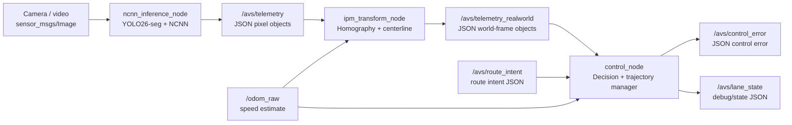

# Báo cáo hệ thống AVS hiện tại

Thư mục này mô tả hệ thống AVS theo code hiện tại của repo `SimpleSysIDV`, không dựa vào các báo cáo cũ trong `docs/reports`.

Phạm vi báo cáo dừng tại topic `/avs/control_error`, bao gồm cả cách `control_node` tính ra các đại lượng `epsilon_x_mm`, `epsilon_y_mm`, `theta_rad`, `curvature_inv_mm`. Báo cáo không phân tích bộ điều khiển downstream/ESP32 sau `/avs/control_error`.

Bản này viết cho người đọc **chưa quen** các khái niệm (segmentation, homography/IPM, trajectory planning, Bezier...) — chương 2 giải thích lý thuyết từ gốc trước khi các chương sau đi vào cách hệ thống cài đặt cụ thể. Mọi công thức/ngưỡng số quan trọng đều được đối chiếu trực tiếp với code hiện tại (kèm tên hàm, tham số) và có ví dụ số minh hoạ.

## Cấu trúc tài liệu

- [00_tong_quan.md](00_tong_quan.md): bài toán hệ thống giải quyết, hệ toạ độ, luồng ROS2/topic chính, và tư tưởng thiết kế 4 tầng trajectory (candidate → normalized → committed).
- [01_co_so_ly_thuyet.md](01_co_so_ly_thuyet.md): lý thuyết nền từ gốc — instance segmentation/NMS/IoU/tracking, homography/IPM, cắt polygon (Sutherland-Hodgman), trích centerline, fit polynomial, lookahead, Bezier, control error — kèm ví dụ số cho từng công thức.
- [02_pipeline_runtime.md](02_pipeline_runtime.md): hợp đồng dữ liệu giữa các node — JSON contract đầy đủ của từng topic, tham số chính.
- [03_ncnn_inference_node.md](03_ncnn_inference_node.md): node suy luận NCNN — decode mask coefficient+prototype, NMS, tracking 2D, mask/polygon telemetry, latency.
- [04_ipm_transform_node.md](04_ipm_transform_node.md): biến đổi pixel sang world frame, cắt vùng hợp lệ, trích centerline, fit polynomial, làm mượt, lookahead.
- [05_control_node_va_control_error.md](05_control_node_va_control_error.md): state machine, path observation, lane legality, chọn lane/T-junction, trajectory planner, lớp chính sách fallback/blocked/hold, normalizer, manager, hybrid direct-IPM, công thức publish `/avs/control_error`.
- [06_gioi_han_va_kiem_thu.md](06_gioi_han_va_kiem_thu.md): giới hạn hiện tại, các chi tiết dễ hiểu nhầm phát hiện khi đối chiếu code, bất biến không được phá vỡ, kiểm thử/build nên chạy, checklist debug runtime.

## Sơ đồ tổng quát

## Kết luận ngắn

Hệ thống hiện tại không còn là pipeline “thấy lane nào thì bám lane đó” đơn giản. Perception tạo ra các quan sát hình học; IPM đưa chúng về hệ tọa độ xe; `control_node` biến quan sát thành `candidate trajectory`, chuẩn hóa qua thời gian, dùng manager để quyết định giữ/cập nhật/replan, rồi mới rút ra một bộ `control_error` duy nhất cho downstream.

Điểm thiết kế quan trọng nhất là: mỗi frame chỉ có một `active trajectory` được publish gián tiếp qua `/avs/control_error`; các lane khác chỉ là ứng viên nội bộ.
